2020/05/16
# Topic: matrix derivative
- [Topic: matrix derivative](#topic-matrix-derivative)
- [主要内容: Matrix Calculus](#%e4%b8%bb%e8%a6%81%e5%86%85%e5%ae%b9-matrix-calculus)
  - [Matrix Calculus 求解网站](#matrix-calculus-%e6%b1%82%e8%a7%a3%e7%bd%91%e7%ab%99)
  - [The Matrix Cookbook](#the-matrix-cookbook)
  - [Other resouces](#other-resouces)
  - [微积分](#%e5%be%ae%e7%a7%af%e5%88%86)
  - [Hessian](#hessian)
    - [Gradient](#gradient)
    - [Taylor expansion](#taylor-expansion)
    - [Field](#field)
      - [Scalar Field](#scalar-field)
      - [Scalar](#scalar)
      - [Vector space](#vector-space)
    - [Jacobian](#jacobian)
    - [Total derivative](#total-derivative)
- [Some notes](#some-notes)
  - [梯度、散度、旋度、Jacobian、Hessian、Laplacian 的关系](#%e6%a2%af%e5%ba%a6%e6%95%a3%e5%ba%a6%e6%97%8b%e5%ba%a6jacobianhessianlaplacian-%e7%9a%84%e5%85%b3%e7%b3%bb)
  - [Products in Linear Algebra](#products-in-linear-algebra)
    - [Products between vectors](#products-between-vectors)
    - [Products between matrices](#products-between-matrices)

# 主要内容: Matrix Calculus
1. [矩阵求导术，上](https://zhuanlan.zhihu.com/p/24709748)
2. [矩阵求导术，下](https://zhuanlan.zhihu.com/p/24863977)

## [Matrix Calculus 求解网站](http://www.matrixcalculus.org/)

## [The Matrix Cookbook](https://www.math.uwaterloo.ca/~hwolkowi/matrixcookbook.pdf)

## Other resouces 
1. [Matrix Calculus in The Matrix Reference Manual](http://www.ee.ic.ac.uk/hp/staff/dmb/matrix/calculus.html)
2. [Matrix Calculus by Johannes](../pdfs/matrix-calculus-illinois-johannes.pdf)
3. [Matrix Calculus by Barnes](../pdfs/MatrixCalculus.pdf)
4. [Old and New Matrix Algebra Useful for Statistics by Minka](../pdfs/Old%20and%20New%20Matrix%20Algebra%20Useful%20for%20Statistics.pdf)

## 微积分 
1. [微积分是什么](https://www.matongxue.com/madocs/845/)
2. [微分和导数的关系](https://www.matongxue.com/madocs/15.html)
3. [微分是什么](https://www.matongxue.com/madocs/847/)
4. [如何通俗易懂地理解全微分](https://www.matongxue.com/madocs/218.html)
5. [微积分的本质，系列视频 by 3Blue1Brown](https://space.bilibili.com/88461692/channel/detail?cid=13407)

## Hessian 
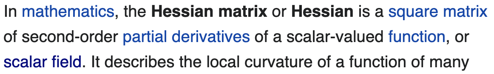
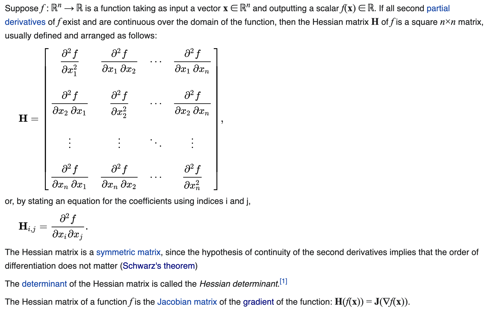
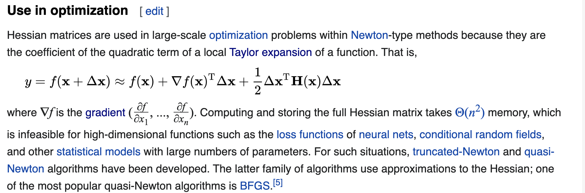

### Gradient 
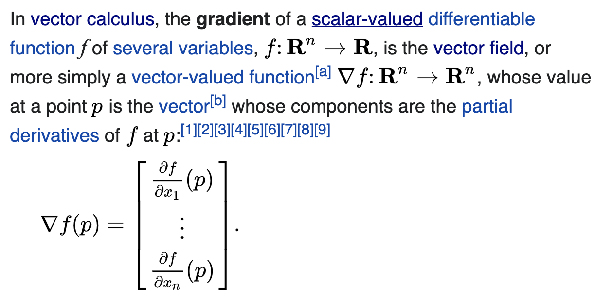
[The gradient by Khan Academy](https://www.khanacademy.org/math/multivariable-calculus/multivariable-derivatives/partial-derivative-and-gradient-articles/a/the-gradient)
[理解方向导数与梯度](https://www.matongxue.com/madocs/222.html)

### Taylor expansion 
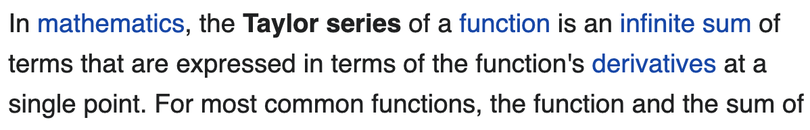
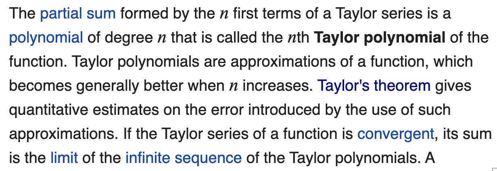
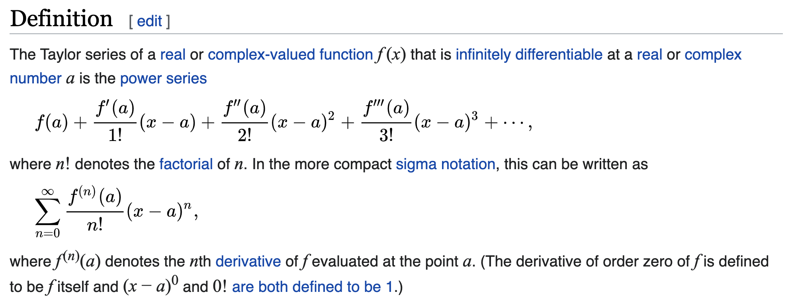

### Field
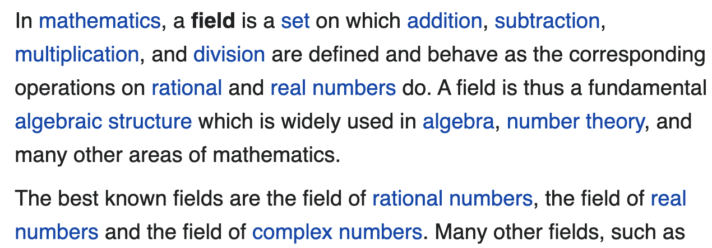

#### Scalar Field 
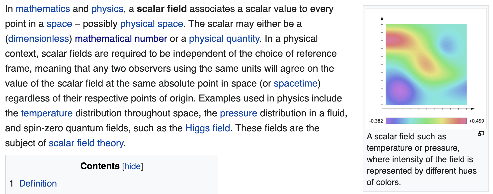

#### Scalar 
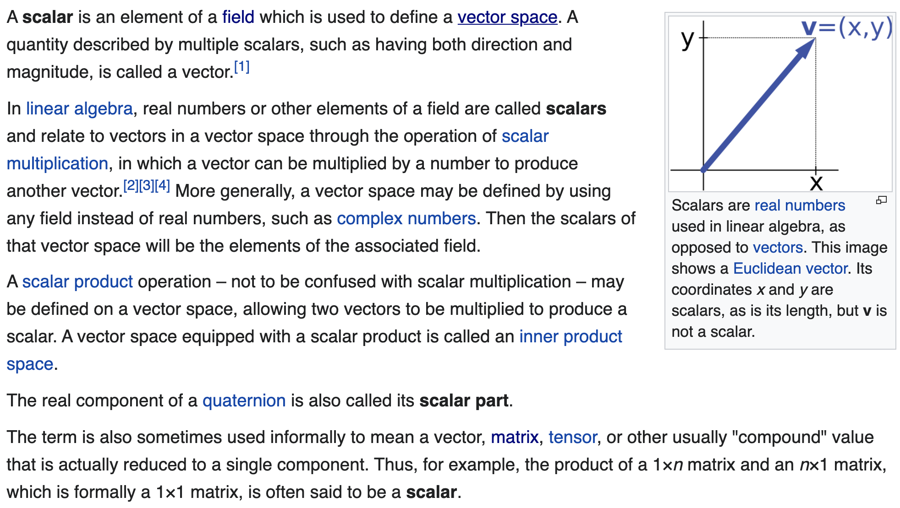

#### Vector space 
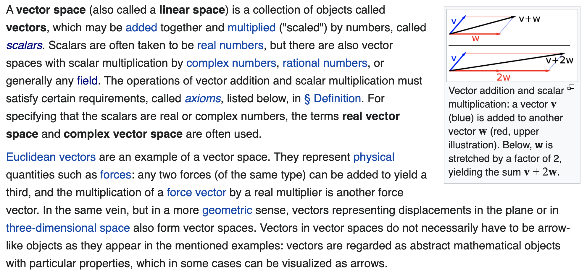

### [Jacobian](_md_figures/Jacobian_matrix_and_determinant.pdf)
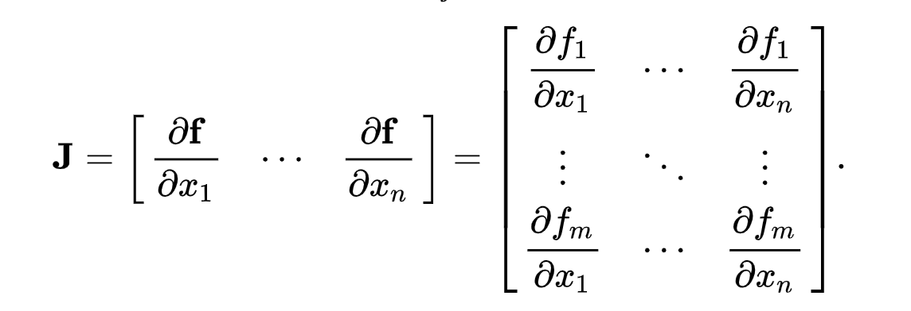

### Total derivative 
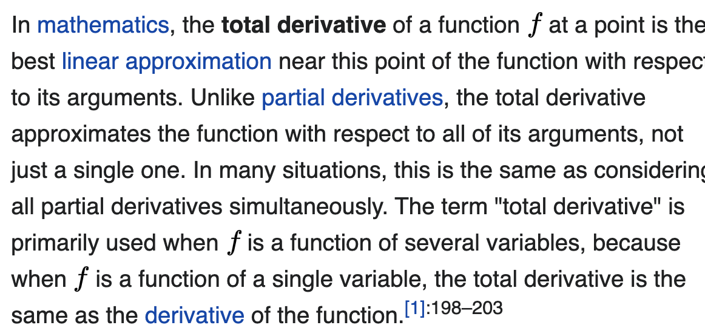
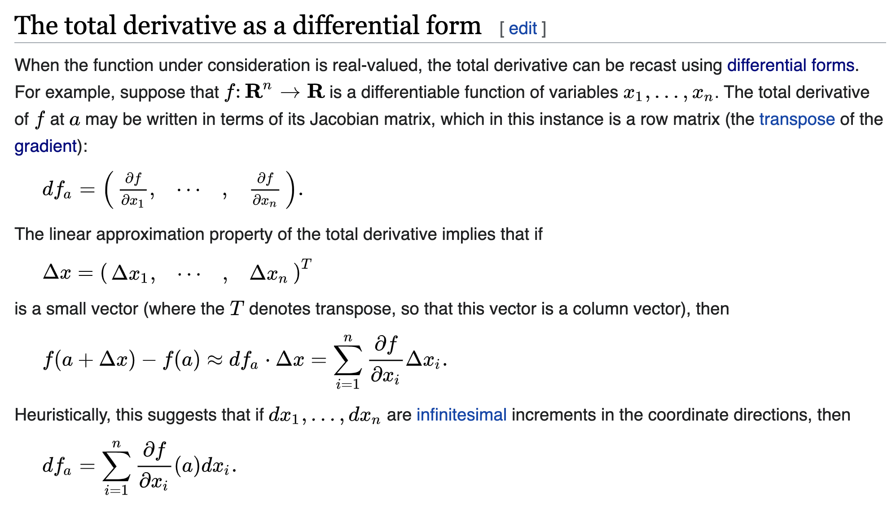

# Some notes

## 梯度、散度、旋度、Jacobian、Hessian、Laplacian 的关系 
[by 王赟 Maigo](https://zhuanlan.zhihu.com/p/35323714)

## Products in Linear Algebra
### Products between vectors
- dot product, also called as:
  - scalar product
  - inner product 
  - Frobenius inner product (generalization of regular inner product from vectors to matrices)
    - 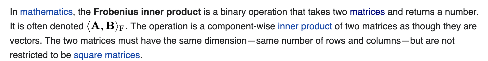
    - 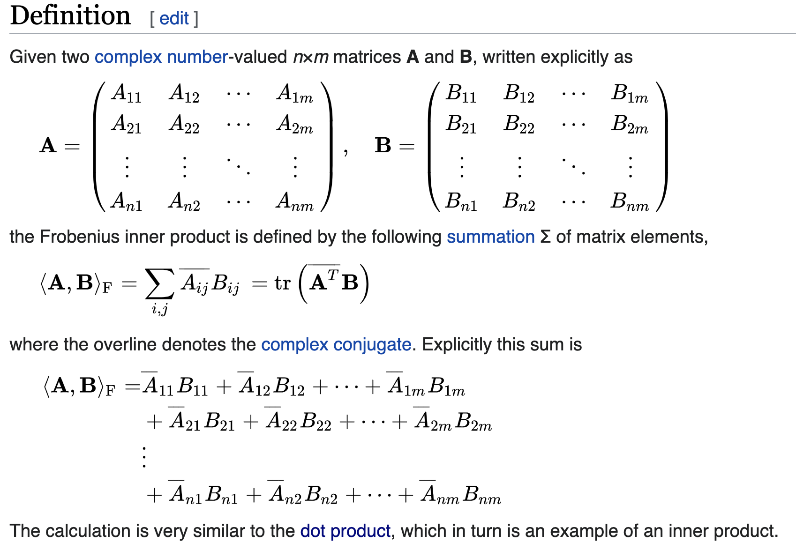
  - projection product 
- cross product (vector product)
- [exterior product](https://en.wikipedia.org/wiki/Exterior_algebra) (wedge product)
- outer product 
- Cartesian product (related to set theory) 
  - 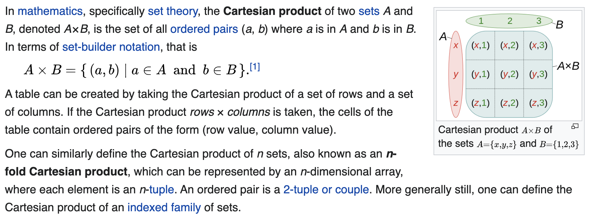
### Products between matrices 
- matrix product 
  - 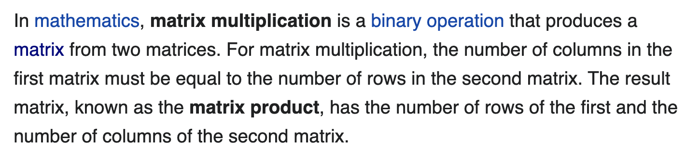
  - 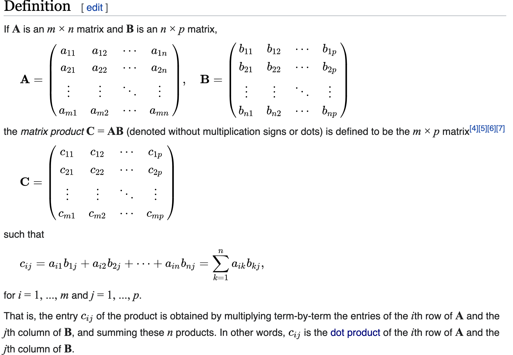
  - 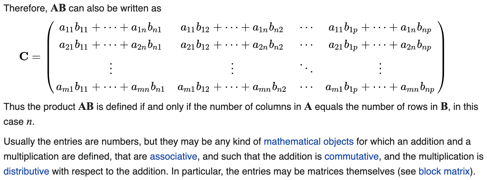
  - 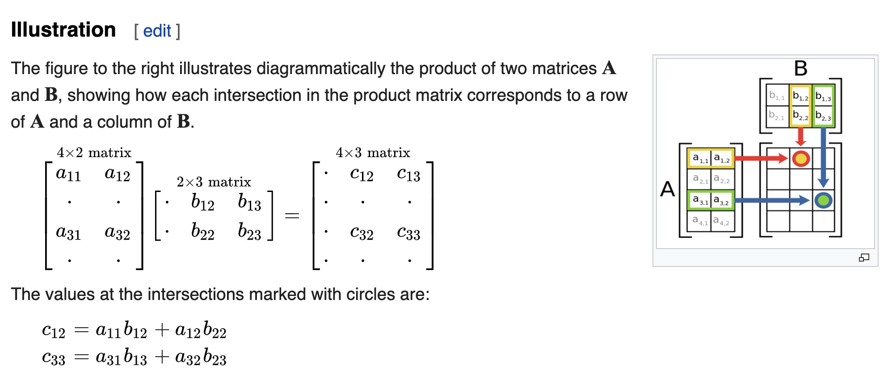
- Hadamard product 
  - 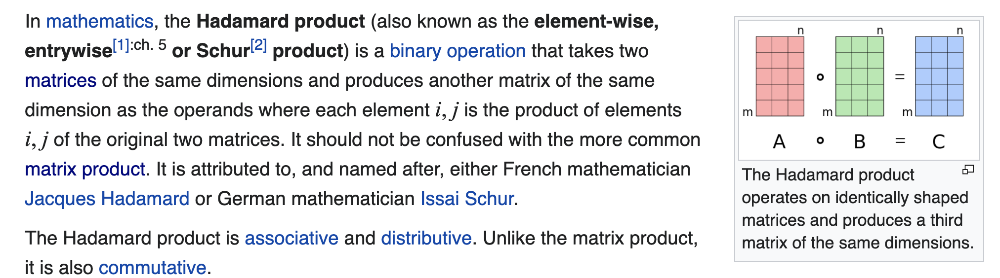
  - 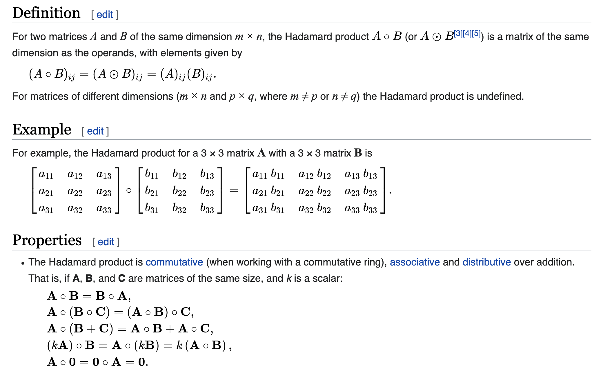
- Kronecker product (generalization of cross product from vectors to matrices)
  - 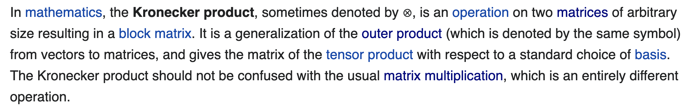
  - 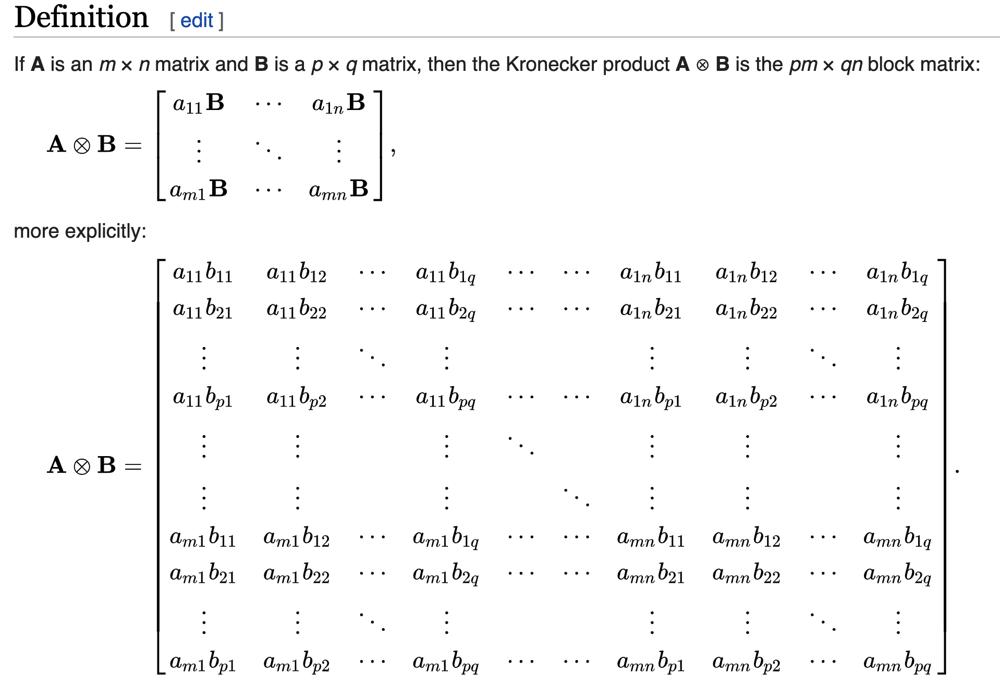