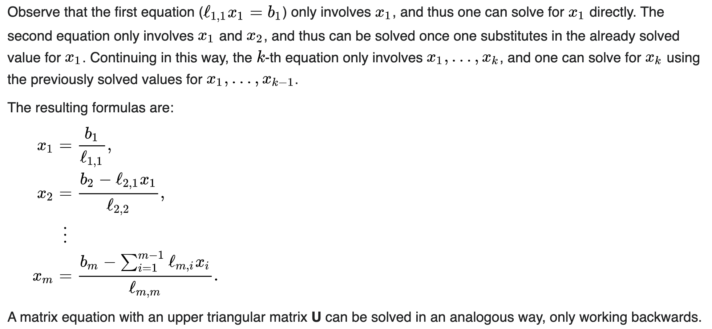
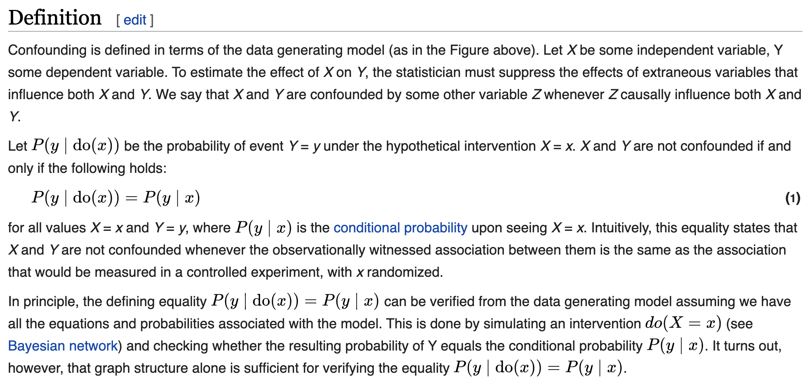
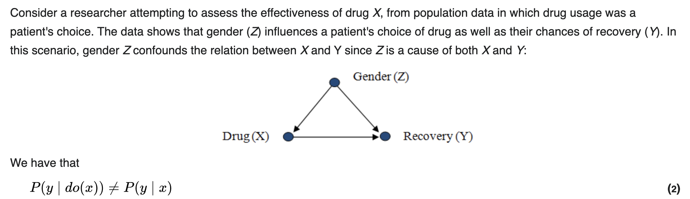
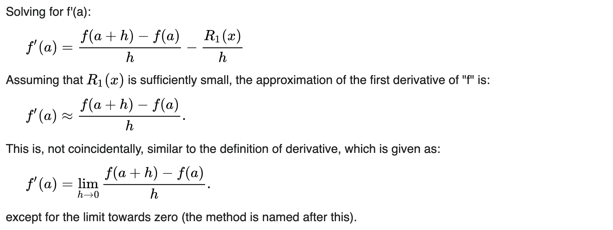
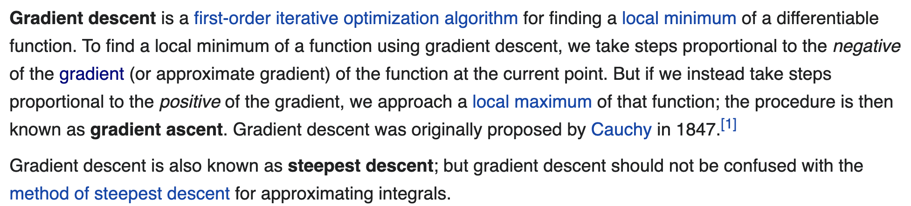
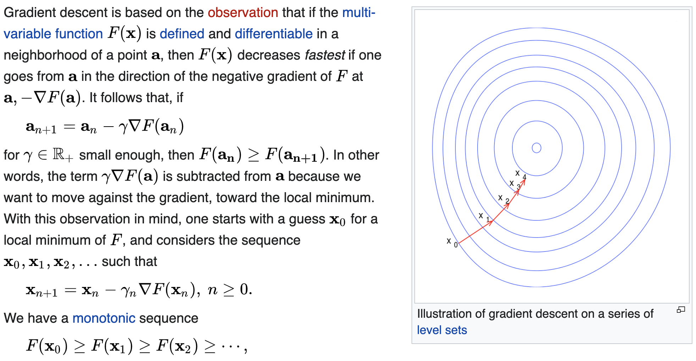
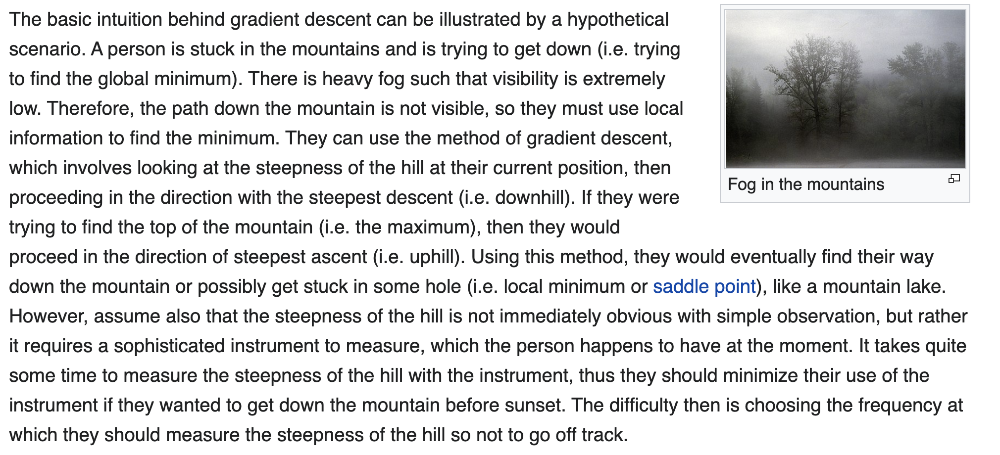

2020/05/17 
# Topic; Least squares problem

- [Topic; Least squares problem](#topic-least-squares-problem)
  - [Main cf.](#main-cf)
  - [Taylor expansion](#taylor-expansion)
  - [Symmetry of second derivatives](#symmetry-of-second-derivatives)
  - [Cholesky decomposition](#cholesky-decomposition)
    - [Triangular matrix](#triangular-matrix)
      - [Forward and backward substitution](#forward-and-backward-substitution)
      - [Principal minors](#principal-minors)
    - [Proof of the existence and uniqueness of Cholesky decomposition](#proof-of-the-existence-and-uniqueness-of-cholesky-decomposition)
    - [Cholesky decomposition algorithm](#cholesky-decomposition-algorithm)
  - [LDLT Cholesky decomposition](#ldlt-cholesky-decomposition)
    - [Incomplete Cholesky decomposition](#incomplete-cholesky-decomposition)
      - [Preconditioning](#preconditioning)
        - [Condition number](#condition-number)
  - [Hermitian matrix](#hermitian-matrix)
    - [Conjugate transpose](#conjugate-transpose)
  - [Definiteness](#definiteness)
  - [Monte Carlo method](#monte-carlo-method)
  - [Least squares](#least-squares)
    - [Least squares problem](#least-squares-problem)
    - [Least squares sovling](#least-squares-sovling)
      - [Linear combination](#linear-combination)
    - [Differences between linear and non-linear least squares](#differences-between-linear-and-non-linear-least-squares)
    - [Relationship to principal components](#relationship-to-principal-components)
    - [Regression analysis](#regression-analysis)
      - [Dependent and independent variables](#dependent-and-independent-variables)
        - [Confounding](#confounding)
    - [Linear least squares](#linear-least-squares)
      - [Moore-Penrose inverse](#moore-penrose-inverse)
      - [Observation](#observation)
        - [Estimator](#estimator)
        - [Population mean](#population-mean)
          - [Population](#population)
          - [Census](#census)
    - [Non-linear least squares](#non-linear-least-squares)
    - [Newton's method](#newtons-method)
      - [Line search](#line-search)
        - [Wolfe conditions](#wolfe-conditions)
      - [Rate of convergence: gradient method vd Newton method](#rate-of-convergence-gradient-method-vd-newton-method)
    - [Gauss-Newton method](#gauss-newton-method)
      - [Backtracking line search](#backtracking-line-search)
    - [Levenberg-Marquardt method](#levenberg-marquardt-method)
      - [Trust region](#trust-region)
    - [A hybrid method: L-M and Quasi-Newton](#a-hybrid-method-l-m-and-quasi-newton)
      - [Quasi-Newton method](#quasi-newton-method)
    - [Secant method](#secant-method)
      - [root-finding algorithms](#root-finding-algorithms)
      - [Finite difference methods](#finite-difference-methods)
        - [Finite difference](#finite-difference)
    - [Gradient descent method](#gradient-descent-method)
      - [Conjugate gradient method](#conjugate-gradient-method)
      - [Stochastic gradient descent](#stochastic-gradient-descent)
        - [M-estimator](#m-estimator)
- [Some notes](#some-notes)
  - [Usage of Big O notation in infinitesimal asymptotics](#usage-of-big-o-notation-in-infinitesimal-asymptotics)
  - [Terms related to analyzing an (parallel) algorithm](#terms-related-to-analyzing-an-parallel-algorithm)
    - [Algorithm graph](#algorithm-graph)
    - [Equivalent perturbation](#equivalent-perturbation)
    - [Computational kernel](#computational-kernel)
    - [flops](#flops)
  - [Homogeneous function](#homogeneous-function)

## Main cf. 
[Methods For Non-Linear Least Squares Problems](figures_least_squares/2004%20Apr%20-%20METHODS%20FOR%20NON-LINEAR%20LEAST%20SQUARES%20PROBLEMS.pdf)

## Taylor expansion
1. [Taylor series expansion](figures_least_squares/taylor_series_expansion.pdf)
2. [Introduction to Taylor's theorem for multivariable functions](figures_least_squares/taylors_theorem_for_multivariable_introduction.pdf)

## Symmetry of second derivatives 

## [Cholesky decomposition](figures_least_squares/cholesky_decomposition.pdf)
1. [Brief but useful notes for Cholesky factorization (decomposition)](figures_least_squares/cholesky_factorization_useful_notes.pdf)
2. [Very useful notes for Cholesky factorization (decomposition)](figures_least_squares/cholesky_factorization_very_useful_notes.pdf)

### Triangular matrix 

#### Forward and backward substitution 

#### Principal minors 

### [Proof of the existence and uniqueness of Cholesky decomposition](https://math.stackexchange.com/a/2520957)

### Cholesky decomposition algorithm
1. [Wiki](figures_least_squares/cholesky_decomposition.pdf)
2. [Algorithm analysis](figures_least_squares/cholesky_decomposition_algorithm.pdf)
3. [Some implementations](https://www.geeksforgeeks.org/cholesky-decomposition-matrix-decomposition/)

## [LDLT Cholesky decomposition](figures_least_squares/ldlt_cholesky.pdf)

### [Incomplete Cholesky decomposition](figures_least_squares/incomplete_cholesky_factorization.pdf)

#### Preconditioning

##### Condition number 
[矩阵的条件数（condition number），from CSDN](https://blog.csdn.net/lanchunhui/article/details/51372831)

## Hermitian matrix 

### Conjugate transpose 

## Definiteness 

## Monte Carlo method

## Least squares
1. [Linear and non-linear least squares overview](figures_least_squares/linear_nonlinear_least_squares.pdf)
2. [non-linear least square regression](figures_least_squares/nonlinear_least_square_regression.pdf)

### Least squares problem

### Least squares sovling 

#### Linear combination 

### Differences between linear and non-linear least squares 

### Relationship to principal components 

### Regression analysis

#### Dependent and independent variables

##### Confounding 

### Linear least squares 

#### Moore-Penrose inverse

#### Observation 

##### [Estimator](figures_least_squares/estimator.pdf)

##### [Population mean](figures_least_squares/population_mean.pdf)

###### [Population](figures_least_squares/population.pdf)

###### [Census](figures_least_squares/census.pdf)

### [Non-linear least squares](figures_least_squares/non_linear_least_squares.pdf)

### [Newton's method](figures_least_squares/newtons_method.pdf)

#### [Line search](figures_least_squares/line_search.pdf)

##### Wolfe conditions
[Wolfe conditions overview](figures_least_squares/wolfe_conditions_overview.pdf)

[A comprehensive explanation for Wolfe conditions](figures_least_squares/wolfe_conditions_comprehensive_explanation.pdf)

#### Rate of convergence: gradient method vd Newton method

### [Gauss-Newton method](figures_least_squares/gauss_newton_method.pdf)

#### [Backtracking line search](figures_least_squares/backtracking_line_search.pdf)

### [Levenberg-Marquardt method](figures_least_squares/levenberg_marquardt_method.pdf)

#### Trust region

### A hybrid method: L-M and Quasi-Newton
[//]: "TODO"

#### [Quasi-Newton method](figures_least_squares/quasi_newton_method.pdf)

### Secant method 
The basic intuition of the secant version of the methods above:  

#### root-finding algorithms

#### Finite difference methods

##### Finite difference 

### Gradient descent method 

#### Conjugate gradient method 
[Conjugate gradient method elaboration](figures_least_squares/conjugate_gradient_elaboration.pdf)

[Conjugate gradient method comprehensive elaboration](figures_least_squares/conjugate_gradient_comprehensive_elaboration.pdf)

[Advanced! The best material for learning conjugate gradient method](figures_least_squares/An%20Introduction%20to%20the%20Conjugate%20Gradient%20Method%20Without%20the%20Agonizing%20Pain.pdf)

#### [Stochastic gradient descent](figures_least_squares/stochastic_gradient_descent.pdf)
[Stochastic gradient descent brief illustration](figures_least_squares/stochastic_gradient_descent_illustration.pdf)

[Advanced! A comprehensive elaboration to stochastic gradient descent](figures_least_squares/Optimization%20Methods%20for%20Large-Scale%20Machine%20Learning.pdf)

[Advanced! An Introduction to Optimization](figures_least_squares/An%20Introduction%20to%20Optimization.pdf)

##### M-estimator

# Some notes 
## [Usage of Big O notation in infinitesimal asymptotics](figures_least_squares/big_o.png)

## Terms related to analyzing an (parallel) algorithm
### Algorithm graph

### Equivalent perturbation 

### Computational kernel 
The part of algorithm that takes up most of the processing time.

### flops 
Complexity can be expressed in terms of floating point operations or flops required to find the solution, expressed as a function of the problem dimension. A Flop serves as a basic unit of computation. It could denote an addition, subtraction, multiplication or division of two floating point numbers.

## [Homogeneous function](https://en.wikipedia.org/wiki/Homogeneous_function)

