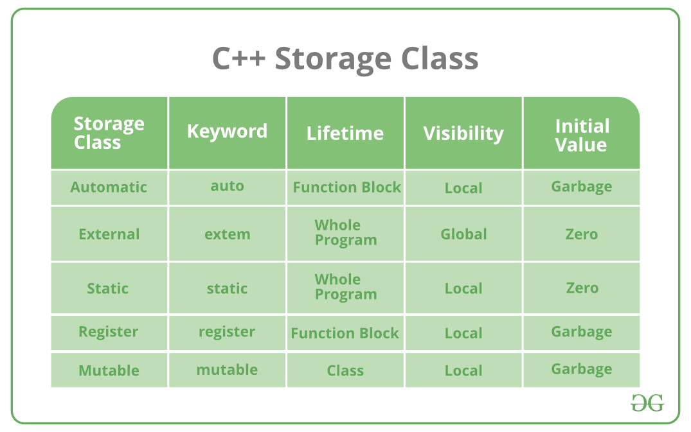

2020/05/21
---
- [Topic; Implement codes of Chapter 6 -- Non-linear Optimization](#topic-implement-codes-of-chapter-6----non-linear-optimization)
  - [chrono](#chrono)
    - [C++ templates](#c-templates)
    - [Implicit conversions](#implicit-conversions)
    - [constexpr and const in C++](#constexpr-and-const-in-c)
      - [C++: constexpr](#c-constexpr)
      - [Constant expressions](#constant-expressions)
        - [Expressions](#expressions)
      - [Literal (字面量)](#literal-字面量)
    - [Function prototype](#function-prototype)
  - [C++ static keyword](#c-static-keyword)
    - [C++: static data members](#c-static-data-members)
  - [C++11 alias declarations (using) and typedef](#c11-alias-declarations-using-and-typedef)
  - [C++ namespace](#c-namespace)
  - [C++ list initialzation](#c-list-initialzation)
  - [C++ trailing return type](#c-trailing-return-type)
  - [C++ typeid](#c-typeid)
  - [C++ container(容器) 简介](#c-container容器-简介)
  - [C++ 函数返回多个值](#c-函数返回多个值)
  - [C++ inline function](#c-inline-function)
  - [C++ pair data structure](#c-pair-data-structure)
  - [C++ tuple data structure](#c-tuple-data-structure)
  - [C++ insert vs emplace](#c-insert-vs-emplace)
  - [C++ emplace_back and std::move](#c-emplace_back-and-stdmove)
  - [C++中的"map, filter, reduce"](#c中的map-filter-reduce)
    - [C++ transform](#c-transform)
    - [C++ accumulate](#c-accumulate)
  - [C++ iterator](#c-iterator)
    - [C++ Do we need include headers that were already included by other headers we included?](#c-do-we-need-include-headers-that-were-already-included-by-other-headers-we-included)
  - [C++ iota function template](#c-iota-function-template)
  - [Eigen ldlt()](#eigen-ldlt)
  - [OpenCV](#opencv)
    - [OpenCV random number generator RNG](#opencv-random-number-generator-rng)
    - [OpenCV plot a graph in accordance with the dataset](#opencv-plot-a-graph-in-accordance-with-the-dataset)
  - [鲁棒核函数(Robust loss function)](#鲁棒核函数robust-loss-function)
  - [C++: performance of using templates](#c-performance-of-using-templates)
  - [C++: functor](#c-functor)
  - [C++: const keyword in member functions](#c-const-keyword-in-member-functions)
  - [C++: How to initialize const member variable in a class?](#c-how-to-initialize-const-member-variable-in-a-class)
    - [C++: const int and int const](#c-const-int-and-int-const)
    - [C++: confusion about const in conjuction with pointer](#c-confusion-about-const-in-conjuction-with-pointer)
    - [C++: mutable keyword](#c-mutable-keyword)
  - [C++: difference between struct and class](#c-difference-between-struct-and-class)
    - [Google C++ style 关于 struct 和 class 的使用规定](#google-c-style-关于-struct-和-class-的使用规定)
  - [C++: pointers and references](#c-pointers-and-references)
    - [关于使用 pointer 和 reference 作为函数形参的约定](#关于使用-pointer-和-reference-作为函数形参的约定)
  - [使用 矩阵变换(transformation) 的思想思考 有关 pointer 的复杂的 declaration statement](#使用-矩阵变换transformation-的思想思考-有关-pointer-的复杂的-declaration-statement)
  - [glog: Google Logging Library](#glog-google-logging-library)
  - [C++: #pragma once](#c-pragma-once)
  - [C++: extern keyword](#c-extern-keyword)
  - [C++: scope resolution operator ::](#c-scope-resolution-operator-)
    - [C++: scope](#c-scope)
  - [C++: storage classes](#c-storage-classes)
    - [C++: mutable keyword](#c-mutable-keyword-1)
  - [C++: enum and enum class](#c-enum-and-enum-class)
  - [C++: identifiers](#c-identifiers)
  - [C++ object constructor and destructor](#c-object-constructor-and-destructor)
  - [Vscode 调试 CMake 编译得到的可执行文件](#vscode-调试-cmake-编译得到的可执行文件)
  - [C++: void keyword](#c-void-keyword)
  - [C++: new and delete for dynamically allocating memory](#c-new-and-delete-for-dynamically-allocating-memory)
  - [C++: memory layout of C/C++ programs](#c-memory-layout-of-cc-programs)
  - [C++ smart pointers and raw pointers](#c-smart-pointers-and-raw-pointers)
    - [Why are pointers not replaced entirely by smart pointers in C++?](#why-are-pointers-not-replaced-entirely-by-smart-pointers-in-c)
  - [50/72 style, make good git commit messages](#5072-style-make-good-git-commit-messages)
  - [Automatic differentiation](#automatic-differentiation)
  - [[C++: Should I put source code in header files?]](#c-should-i-put-source-code-in-header-files)
  - [C++: making the class public and making its content public](#c-making-the-class-public-and-making-its-content-public)
  - [C++: difference between qualifers and keywords](#c-difference-between-qualifers-and-keywords)
  - [C++: avoid using const non-static (data) member variables](#c-avoid-using-const-non-static-data-member-variables)
  - [C++: inheritance](#c-inheritance)
    - [C++: 虚函数(virtual function) 与 纯虚函数(pure virtual function) 与 抽象类(abstract class)](#c-虚函数virtual-function-与-纯虚函数pure-virtual-function-与-抽象类abstract-class)
      - [C++: virtual table (aka, vtable)](#c-virtual-table-aka-vtable)
      - [C++: override specifier](#c-override-specifier)
      - [C++: final specifier](#c-final-specifier)
      - [C++: abstract class](#c-abstract-class)
    - [C++: polymorphism](#c-polymorphism)
      - [An elaborative illustration for runtime polymorphism](#an-elaborative-illustration-for-runtime-polymorphism)
  - [C++: 几种 for loop 写法的对比](#c-几种-for-loop-写法的对比)
  - [C++: 关于 accumulate 的一些用法](#c-关于-accumulate-的一些用法)
  - [C++: 造轮子: map and reduce](#c-造轮子-map-and-reduce)
  - [C++: 模板形参包(parameter pack)](#c-模板形参包parameter-pack)
  - [C++: explicit keyword](#c-explicit-keyword)
  - [C++: 函数作为参数](#c-函数作为参数)
  - [C++: std::function vs template](#c-stdfunction-vs-template)
    - [C++: std::function](#c-stdfunction)
  - [C++: smart pointers](#c-smart-pointers)
    - [C++: shared_ptr](#c-shared_ptr)
      - [Mechanism of shared_ptr](#mechanism-of-shared_ptr)
      - [When use the shared_ptr in containers](#when-use-the-shared_ptr-in-containers)
      - [smart pointers and new](#smart-pointers-and-new)
    - [unique_ptr](#unique_ptr)
      - [make_unique](#make_unique)
    - [weak_ptr](#weak_ptr)
      - [Purposes to use the shared_ptr](#purposes-to-use-the-shared_ptr)
      - [C++: make_shared](#c-make_shared)
  - [C++: private, protected, public keyword](#c-private-protected-public-keyword)
    - [C++: Inheritance access specifiers](#c-inheritance-access-specifiers)
  - [C++: override specifier](#c-override-specifier-1)
    - [C++: 纯说明符(= 0)与抽象类](#c-纯说明符-0与抽象类)
  - [C++: explicit default constructor,  = default](#c-explicit-default-constructor--default)
  - [C++: 前向声明(forward declaration)](#c-前向声明forward-declaration)
  - [C++: attributes](#c-attributes)
  - [C++: fields](#c-fields)
  - [C++: casting](#c-casting)
    - [C++: static_cast operator](#c-static_cast-operator)
    - [C++: dynamic_cast operator](#c-dynamic_cast-operator)
  - [C++: 多线程](#c-多线程)
    - [C++: volatile keyword](#c-volatile-keyword)
  - [C++: vector 中保存指针的一些讨论](#c-vector-中保存指针的一些讨论)
    - [C++: 关于 vector 中保存 原生指针 还是 智能指针 的讨论](#c-关于-vector-中保存-原生指针-还是-智能指针-的讨论)
  - [C++: lifetime of objects](#c-lifetime-of-objects)
    - [static and automatic objects](#static-and-automatic-objects)
    - [dynamic objects](#dynamic-objects)
    - [static, stack and heap memory](#static-stack-and-heap-memory)
      - [Dynamic memory allocation](#dynamic-memory-allocation)
    - [new and delete](#new-and-delete)
    - [dangling pointer](#dangling-pointer)
  - [C++: friend keyword](#c-friend-keyword)
  - [C++: translation units and linkage](#c-translation-units-and-linkage)
    - [C++: internal linkage and external linkage](#c-internal-linkage-and-external-linkage)
      - [Scope and linkage](#scope-and-linkage)
  - [C++: storage classes](#c-storage-classes-1)
  - [C++: constant expressions](#c-constant-expressionsc-constant-expressions)
  - [C++: nested classes](#c-nested-classes)
  - [C++: bitset class template](#c-bitset-class-template)
  - [C++: unordered_map](#c-unordered_map)
    - [C++: map vs unordered_map](#c-map-vs-unordered_map)
  - [C++: const and non-const member functions](#c-const-and-non-const-member-functions)
    - [在这种情况下，如何避免 写两次 同样的函数体 并 规避可能的 const 转换错误](#在这种情况下如何避免-写两次-同样的函数体-并-规避可能的-const-转换错误)
      - [调用顺序不同会引发的问题](#调用顺序不同会引发的问题)
    - [C++: const member functions](#c-const-member-functions)
  - [C++: deep copy and shallow copy](#c-deep-copy-and-shallow-copy)
  - [C++: friend struct/class](#c-friend-structclass)
  - [C++: (void) variables](#c-void-variables)
  - [C++: assert macro](#c-assert-macro)
  - [C++: CppCon](#c-cppcon)
  - [C++ tricks](#c-tricks)
  - [C++ 工程搭建的注意点](#c-工程搭建的注意点)

# Topic; Implement codes of Chapter 6 -- Non-linear Optimization

## [chrono](http://www.cplusplus.com/reference/chrono/)
- steady_clock 
- time_point
- duration 
- duration_cast 
- duration.count()

### C++ templates
[Templates overview](figures_ch6/overloads_and_templates.pdf)

### [Implicit conversions](https://en.cppreference.com/w/c/language/conversion)

### constexpr and const in C++
[C++ const 和 constexpr 的区别](https://www.zhihu.com/question/35614219)

[Advanced! A comprehensive explanation for constexpr](https://en.cppreference.com/w/cpp/language/constexpr)

[More about them](https://docs.microsoft.com/en-us/cpp/cpp/constexpr-cpp?view=vs-2019)

简要地说：const 是 read-only, 只读； constexpr 才是 constant, 常量。

**All constexpr variables are const.**

#### [C++: constexpr](https://docs.microsoft.com/en-us/cpp/cpp/constexpr-cpp?view=vs-2019)
The keyword constexpr was introduced in C++11 and improved in C++14. It means constant expression. Like const, it can be applied to variables: A compiler error is raised when any code attempts to modify the value. Unlike const, constexpr can also be applied to functions and class constructors. constexpr indicates that the value, or return value, is constant and, where possible, is computed at compile time.

A constexpr integral value can be used wherever a const integer is required, such as in template arguments and array declarations. And when a value is computed at compile time instead of run time, it helps your program run faster and use less memory.

To limit the complexity of compile-time constant computations, and their potential impacts on compilation time, the C++14 standard requires the types in constant expressions to be literal types.

**A constexpr function or constructor is implicitly inline.**

#### Constant expressions 
An expression that can be evaluated at compile time. 

##### Expressions 
An expression is a sequence of operators and their operands, that specifies a computation.

Expression evaluation may produce a result (e.g., evaluation of 2+2 produces the result 4) and may generate side-effects (e.g. evaluation of std::printf("%d",4) prints the character '4' on the standard output).

#### Literal (字面量)
[字面量，常量和变量之间的区别](https://www.jianshu.com/p/0f2816805da6)

A literal type is one whose layout can be determined at compile time. The following are the literal types:

- void
- scalar types
- references
- Arrays of void, scalar types or references

A class that has a trivial destructor, and one or more constexpr constructors that are not move or copy constructors. Additionally, all its non-static data members and base classes must be literal types and not volatile.

### [Function prototype](https://codescracker.com/cpp/cpp-function-definition.htm)

## [C++ static keyword](figures_ch6/cpp_static.pdf)
[A comprehensive elaboration about static keyworkd](https://www.bogotobogo.com/cplusplus/statics.php)

First, static specifier when used on global variables limits the variable's scope to the source file in which it is defined.

Second, static and extern specifiers are mutually exclusive therefore declaration of a static variable is also it's definition (tentative definition in particular).

**结合 C++ 程序的 memory 来思考 static keyword**

### [C++: static data members](https://docs.microsoft.com/en-us/cpp/cpp/static-members-cpp?view=vs-2019)
Classes can contain static member data and member functions. When a data member is declared as static, only one copy of the data is maintained for all objects of the class.

Static data members are not part of objects of a given class type. As a result, the declaration of a static data member is not considered a definition. The data member is declared in class scope, but definition is performed at file scope. These static members have external linkage.

Static data members are subject to class-member access rules, so private access to static data members is allowed only for class-member functions and friends. These rules are described in Member-Access Control. The exception is that static data members must be defined in file scope regardless of their access restrictions. If the data member is to be explicitly initialized, an initializer must be provided with the definition.

The type of a static member is not qualified by its class name. Therefore, the type of BufferedOutput::bytecount is long.

## C++11 alias declarations (using) and typedef 
cf. Effective Modern C++  Item 9: Prefer alias declarations to typedefs. 

[对 Item 9 的中文解释](https://zhuanlan.zhihu.com/p/21264013)

## [C++ namespace](figures_ch6/cpp_namespace.pdf)

## C++ list initialzation 
[A comprehensive elaboration](https://zh.cppreference.com/w/cpp/language/list_initialization)

## C++ trailing return type 
[Shoule we use it?](https://stackoverflow.com/questions/11215227/should-the-trailing-return-type-syntax-style-become-the-default-for-new-c11-pr)

## C++ typeid 
[使用 typeid 判断 “类型” 和 “表达式” 的类型](https://zh.cppreference.com/w/cpp/language/typeid)

## [C++ container(容器) 简介](https://zh.cppreference.com/w/cpp/container)

## C++ 函数返回多个值
[一些方法的讨论](https://www.zhihu.com/question/57540006)

## C++ inline function
[inline functions in C++ by GeeksforGeeks](https://www.geeksforgeeks.org/inline-functions-cpp/)

## [C++ pair data structure](http://www.cplusplus.com/reference/utility/pair/)
vector<pair<Tx, Ty>> Foo; 

Foo.push_back(make_pair(a, b)) 或 Foo.emplace(a, b)

## [C++ tuple data structure](http://www.cplusplus.com/reference/tuple/)
[Add elements to a tuple](https://stackoverflow.com/questions/41421669/how-to-add-elements-to-a-vector-of-tuples/41421896#41421896)

## C++ insert vs emplace 
In C++, all containers (vector, stack, queue, set, map, etc) support both insert and emplace operations.

The advantage of emplace is, it does in-place insertion and avoids an unnecessary copy of object. For primitive data types, it does not matter which one we use. But for objects, use of emplace() is preferred for efficiency reasons.

## C++ emplace_back and std::move 
[A bit of discussion](https://stackoverflow.com/a/35405103)

## C++中的"map, filter, reduce" 
python的map，filter和reduce函数，在标准C++中分别有std::transform（对应python的map），std::copy_if（对应python的filter），std::accumulate（对应python的reduce）。

### [C++ transform](https://www.jianshu.com/p/cbe722ca4276)

### [C++ accumulate](https://www.jianshu.com/p/405cf683cba7)

## [C++ iterator](http://www.cplusplus.com/reference/iterator/)

### [C++ Do we need include headers that were already included by other headers we included?](https://stackoverflow.com/questions/38926640/is-it-necessary-to-include-header-iterator-to-use-begin-and-end-functions)

## [C++ iota function template](http://www.cplusplus.com/reference/numeric/iota/)

## [Eigen ldlt()](https://eigen.tuxfamily.org/dox/classEigen_1_1MatrixBase.html#a0ecf058a0727a4cab8b42d79e95072e1)

## OpenCV 
### [OpenCV random number generator RNG](https://docs.opencv.org/4.3.0/d1/dd6/classcv_1_1RNG.html#a8df8ce4dc7d15916cee743e5a884639d)

### [OpenCV plot a graph in accordance with the dataset](https://gist.github.com/UnaNancyOwen/ae41d341c054f0b1193839ecf03bb01e)
[OpenCV official plot modules](https://docs.opencv.org/3.4/d0/d1e/classcv_1_1plot_1_1Plot2d.html#a888b6963153283c6d0f22370d8144823)

## 鲁棒核函数(Robust loss function)
[Huber loss](https://en.wikipedia.org/wiki/Huber_loss)

## [C++: performance of using templates](https://stackoverflow.com/questions/2442358/do-c-templates-make-programs-slow)

## [C++: functor](https://stackoverflow.com/questions/356950/what-are-c-functors-and-their-uses)

## C++: const keyword in member functions
简要的说明: 说明this指针是一个pointer to const object，所以函数里不能修改non-static data member的值，注意，static member是可以被修改的。

[A thorough discussion about const keyword](https://stackoverflow.com/a/751783)

[More about const](https://www.learncpp.com/cpp-tutorial/810-const-class-objects-and-member-functions/)

## [C++: How to initialize const member variable in a class?](https://stackoverflow.com/questions/14495536/how-to-initialize-const-member-variable-in-a-class)

### [C++: const int and int const](https://stackoverflow.com/questions/3247285/const-int-int-const)

### [C++: confusion about const in conjuction with pointer](https://www.geeksforgeeks.org/difference-between-const-int-const-int-const-and-int-const/)

### [C++: mutable keyword](figures_ch6/cpp_mutable.pdf)

## C++: difference between struct and class 
The only difference between a struct and class in C++ is the default accessibility of member variables and methods. In a struct they are public; in a class they are private.

只有数据成员时及必要的构造、析构等成员函数时，使用 struct; 其他一律用 class.

### Google C++ style 关于 struct 和 class 的使用规定
仅当只有数据成员时使用 struct, 其它一概使用 class.

struct 用来定义包含数据的被动式对象, 也可以包含相关的常量, 但除了存取数据成员之外, 没有别的函数功能. 并且存取功能是通过直接访问位域, 而非函数调用. 除了构造函数, 析构函数, Initialize(), Reset(), Validate() 等类似的用于设定数据成员的函数外, 不能提供其它功能的函数.

## [C++: pointers and references](https://www.geeksforgeeks.org/pointers-vs-references-cpp/)

### [关于使用 pointer 和 reference 作为函数形参的约定](https://stackoverflow.com/questions/2627166/difference-between-const-reference-and-normal-parameter)
1. 如函数可能会修改传入的参数，应该使用 typename *var; 
  - 这样可以使得调用方的代码区别于 传值 或 传引用 的代码: 
    - typename *var -> 调用方必须使用 dereference sign &;
    - 传值 或 传引用 则不必。
2. 当传入一个“很大”的数据结构或类时，使用 const typename &var;
  - 尽管 传引用 也能达到修改值的效果，但为了统一规则，减少歧义，增强构建方和调用方对于代码解读的一致性，统一使用 const 修饰，即 **所有按引用传递的参数必须加上 const**。
  - 这种写法“强制”调用方只会在 **默认该函数不会修改传入的参数** 时才使用这种写法。
  - 为保持一致性，通常在 传入的数据结构和类 很小时，也应该使用这种写法。
3. 当传入的参数是通常可见的 常量，简单的 整型、浮点型变量时，使用传值写法 typename var;
  - 根据情况使用 const 修饰。

## 使用 矩阵变换(transformation) 的思想思考 有关 pointer 的复杂的 declaration statement
e.g. const T * const x; 
矩阵变换，可以看作从右往左读的方法: 
1. 定义 x;
2. 将 x 设为 const;
3. 将 const x 设为 指针；
4. 将 * const x 设为 指向 T 的指针;
5. 将 T * const x 指向的对象 T 设为 const;

## glog: Google Logging Library 
[How to use glog](http://rpg.ifi.uzh.ch/docs/glog.html)
[中文 brief instructions](http://senlinzhan.github.io/2017/10/07/glog/)

## [C++: #pragma once](https://zh.wikipedia.org/wiki/Pragma_once)

## [C++: extern keyword](https://stackoverflow.com/a/10422049)
[cf.](https://docs.microsoft.com/en-us/cpp/cpp/extern-cpp?view=vs-2019)

The extern keyword has four meanings depending on the context:
1. In a non-const global variable declaration, extern specifies that the variable or function is defined in another translation unit. The extern must be applied in all files except the one where the variable is defined.
2. In a const variable declaration, it specifies that the variable has external linkage. The extern must be applied to all declarations in all files. (Global const variables have internal linkage by default.)
3. extern "C" specifies that the function is defined elsewhere and uses the C-language calling convention. The extern "C" modifier may also be applied to multiple function declarations in a block.
4. In a template declaration, extern specifies that the template has already been instantiated elsewhere. extern tells the compiler it can reuse the other instantiation, rather than create a new one at the current location. For more information about this use of extern, see Explicit instantiation.

## [C++: scope resolution operator ::](https://stackoverflow.com/a/15649663)
[The purposes to use scope resolution operator](https://www.geeksforgeeks.org/scope-resolution-operator-in-c/)

[Some supplementary materials](https://docs.microsoft.com/en-us/cpp/cpp/scope-resolution-operator?view=vs-2019)

### [C++: scope](https://docs.microsoft.com/en-us/cpp/cpp/scope-visual-cpp?view=vs-2019)

## [C++: storage classes](https://docs.microsoft.com/en-us/cpp/cpp/storage-classes-cpp?view=vs-2019)

A storage class in the context of C++ variable declarations is a type specifier that governs the lifetime, linkage, and memory location of objects.

Storage class keywords: 
  - auto 
  - extern 
  - static 
  - register 
  - mutable 

static and extern are two of the keywords of the strorage classes.

[A comprehensive elaboration](https://www.geeksforgeeks.org/storage-classes-in-c-with-examples/)

### [C++: mutable keyword](https://docs.microsoft.com/en-us/cpp/cpp/mutable-data-members-cpp?view=vs-2019)

## [C++: enum and enum class](https://docs.microsoft.com/en-us/cpp/cpp/enumerations-cpp?view=vs-2019)
elements in enum object can be accessed by everyone throught the scope where enum is defined.

elements in enum class object can only be accessed using scope resolution operator ::, hence scoped enums. The "class" here indicates encapsulation.

## [C++: identifiers](https://www.w3schools.com/cpp/cpp_variables_identifiers.asp)
All C++ variables must be identified with unique names.

These unique names are called identifiers.

## C++ object constructor and destructor 
[简单的使用示例](https://www.runoob.com/cplusplus/cpp-constructor-destructor.html)

## Vscode 调试 CMake 编译得到的可执行文件 
修改 launch.json 中的 program 参数的值即可。

## [C++: void keyword](figures_ch6/cpp_void.pdf)

## [C++: new and delete for dynamically allocating memory](https://www.geeksforgeeks.org/new-and-delete-operators-in-cpp-for-dynamic-memory/)

## C++: memory layout of C/C++ programs 
[Discussion I](https://www.geeksforgeeks.org/memory-layout-of-c-program/)

[Discussion II](https://www.learncpp.com/cpp-tutorial/79-the-stack-and-the-heap/)

## C++ smart pointers and raw pointers 

### [Why are pointers not replaced entirely by smart pointers in C++?](https://www.quora.com/Why-are-pointers-not-replaced-entirely-by-smart-pointers-in-C++#)
[A bit of discussion](https://stackoverflow.com/questions/3396939/replacing-existing-raw-pointers-with-smart-pointers)

## [50/72 style, make good git commit messages](figures_ch6/good_git_commit_messages.pdf)

## [Automatic differentiation](https://en.wikipedia.org/wiki/Automatic_differentiation)

## [C++: Should I put source code in header files?]
It's not bad style, you can put source code in header files, and some times you're forced to, in particular:
- When defining a template class/function.
- When defining an inline function.

Anyway you shouldn't put a free (defined outside a class scope) non-inline function in a header file, since that would be compiled any time a source file include such header (and this will give you a linking error).

## [C++: making the class public and making its content public](https://stackoverflow.com/a/4792783)

## [C++: difference between qualifers and keywords](https://stackoverflow.com/questions/3785789/what-is-the-meaning-of-qualifier)

## [C++: avoid using const non-static (data) member variables](https://www.reddit.com/r/cpp/comments/8wbeom/coding_guideline_avoid_const_member_variables/)

## [C++: inheritance](https://www.geeksforgeeks.org/inheritance-in-c/)

### [C++: 虚函数(virtual function) 与 纯虚函数(pure virtual function) 与 抽象类(abstract class)](https://blog.csdn.net/hackbuteer1/article/details/7558868)
[A typical example](https://www.programiz.com/cpp-programming/virtual-functions)

[Another illustration for virtual function](https://www.geeksforgeeks.org/virtual-function-cpp/)

[A very good illustration about virtual function](https://docs.microsoft.com/en-us/cpp/cpp/virtual-functions?view=vs-2019)

The virtual keyword can be used when declaring overriding functions in a derived class, but it is unnecessary; overrides of virtual functions are always virtual.

#### [C++: virtual table (aka, vtable)](figures_ch6/cpp_vtable.pdf)

#### [C++: override specifier](https://docs.microsoft.com/en-us/cpp/cpp/override-specifier?view=vs-2019)

#### [C++: final specifier](https://docs.microsoft.com/en-us/cpp/cpp/final-specifier?view=vs-2019)

#### [C++: abstract class](https://docs.microsoft.com/en-us/cpp/cpp/abstract-classes-cpp?view=vs-2019)

### C++: polymorphism 
[A brief illustration](https://www.geeksforgeeks.org/polymorphism-in-c/)

#### [An elaborative illustration for runtime polymorphism](https://www.geeksforgeeks.org/virtual-functions-and-runtime-polymorphism-in-c-set-1-introduction/)
一个指针分两个部分：它实际所指向的内存，及它的类型。实际情况下，指针所指向的内存可以不保存相应类型的数据，这为 运行时多态 提供了支持。 e.g. 

BaseClass* p = new DerivedClass; 

这种情况下，尽管 p 的类型(等号左边)是指向 BaseClass 的指针，但实际所指向的内存保存的是 DerivedClass 类型的数据。因此，当我们 dereference p 时，得到的是 DerivedClass 类型的 Object, 所调用的 函数和数据成员 也是 DerivedClass 的。

运行时多态 通过 vtable(虚函数表) 及 vptr 实现。

## [C++: 几种 for loop 写法的对比](https://www.zhihu.com/question/54671272)
1. Regular for 
2. [for_each](https://zh.cppreference.com/w/cpp/algorithm/for_each)
3. range-based for 

## [C++: 关于 accumulate 的一些用法](figures_ch6/accumulate%20-%20Exploring%20an%20Algorithmic%20Empire%20-%20Ben%20Deane%20-%20CppCon%202016.pdf)

## [C++: 造轮子: map and reduce](figures_ch6/cpp_map_reduce.pdf)

## [C++: 模板形参包(parameter pack)](https://zh.cppreference.com/w/cpp/language/parameter_pack)
[一些可参考的资源](figures_ch6/cpp_parameter_pack.pdf)

## [C++: explicit keyword](figures_ch6/cpp_explicit.pdf)
在C++中explicit关键字只能用来修饰构造函数。使用explicit可以禁止编译器自动调用拷贝初始化，还可以禁止编译器对拷贝函数的参数进行隐式转换。

[关于 explicit 使用的一些讨论](https://zhuanlan.zhihu.com/p/52152355)

Author of *Effective C++* says: 

> 被声明为explicit的构造函数通常比其 non-explicit 兄弟更受欢迎, 因为它们禁止编译器执行非预期 (往往也不被期望) 的类型转换. 除非我有一个好理由允许构造函数被用于隐式类型转换, 否则我会把它声明为explicit. 我鼓励你遵循相同的政策.

## C++: 函数作为参数 
[关于一般写法的讨论](https://www.quora.com/How-do-I-pass-a-function-as-an-argument-to-another-function-in-c++-1)

[使用 std::function 的写法](https://stackoverflow.com/a/31521586)

## [C++: std::function vs template](https://stackoverflow.com/questions/14677997/stdfunction-vs-template)
[A bit of discussion](https://www.zhihu.com/question/41684177/answer/91952216)

### C++: std::function
// TODO 

## C++: smart pointers 
[A brief illustration](https://stackoverflow.com/a/30143936)

**To get elaborative illustration, see C++ Primer Chapter 12, page 562~**

### C++: shared_ptr 

#### Mechanism of shared_ptr 
It is up to the implementation whether to use a counter or another data structure to keep track of how many pointers share state. The key point is that the class keeps track of how many shared_ptrs point to the same object and automatically frees that object when appropriate.

当没有一个智能指针指向这个 动态分配的内存所对应的东西 时，这个东西由与这个东西类型相应的 destructor free. e.g.: 

When p is destroyed, its reference count is decremented and checked. In this case, p is the only object referring to the memory returned by factory. Because p is about to go away, the object to which p points will be destroyed and the memory in which that object resides will be freed.

#### When use the shared_ptr in containers 
If you put shared_ptrs in a container, and you subsequently need to use some, but not all, of the elements, remember to erase the elements you no longer need.

P.S. The elements allocated by a vector exist only while the vector itself exists. When a vector is destroyed, the elements in the vector are also destroyed. i.e. **copying a vector into another vector will possibly destroy the original vector.**

#### smart pointers and new 
The smart pointer constructors that take pointers are **explicit**. Hence, we cannot implicitly convert a built-in pointer to a smart pointer; we must use the direct form of initialization to initialize a smart pointer:

[An example illustrating this](figures_ch6/cppcon_smart_pointers.pdf))

A shared_ptr can coordinate destruction only with other shared_ptrs that are copies of itself. Indeed, this fact is one of the reasons we recommend using make_shared rather than new. That way, we bind a shared_ptr to the object at the same time that we allocate it. There is no way to inadvertently bind the same memory to more than one independently created shared_ptr.

When we bind a shared_ptr to a plain pointer, we give responsibility for that memory to that shared_ptr. Once we give shared_ptr responsibility for a pointer, we should no longer use a built-in pointer to access the memory to which the shared_ptr now points.

It is dangerous to use a built-in pointer to access an object owned by a smart pointer, because we may not know when that object is destroyed.

### unique_ptr 
A unique_ptr “owns” the object to which it points. Unlike shared_ptr, only one unique_ptr at a time can point to a given object. The object to which a unique_ptr points is destroyed when the unique_ptr is destroyed.

Unlike shared_ptr, *there is no library function*(Now, we have make_unique) comparable to make_shared that returns a unique_ptr. Instead, when we define a unique_ptr, we bind it to a pointer returned by new. As with shared_ptrs, we must use the direct form of initialization. 

#### make_unique 

### weak_ptr 
A weak_ptr is a smart pointer that does not control the lifetime of the object to which it points. Instead, a weak_ptr points to an object that is managed by a shared_ptr. Binding a weak_ptr to a shared_ptr does not change the reference count of that shared_ptr. Once the last shared_ptr pointing to the object goes away, the object itself will be deleted. That object will be deleted even if there are weak_ptrs pointing to it—hence the name weak_ptr, which captures the idea that a weak_ptr shares its object “weakly.”

When we create a weak_ptr, we initialize it from a shared_ptr.

#### Purposes to use the shared_ptr 
Programs tend to use dynamic memory for one of three purposes: 
1. They don’t know how many objects they’ll need
2. They don’t know the precise type of the objects they need 
3. They want to share data between several objects

#### C++: make_shared 
The safest way to allocate and use dynamic memory is to call a library function named make_shared. This function allocates and initializes an object in dynamic memory and returns a shared_ptr that points to that object. Like the smart pointers, make_shared is defined in the memory header.

When we call make_shared, we must specify the type of object we want to create. We do so in the same way as we use a template class, by following the function name with a type enclosed in angle brackets:

Like the sequential-container emplace members (§ 9.3.1, p. 345), make_shared uses its arguments to construct an object of the given type. For example, a call to make_shared<string> must pass argument(s) that match one of the string constructors. Calls to make_shared<int> can pass any value we can use to initialize an int. And so on. If we do not pass any arguments, then the object is value initialized (§ 3.3.1, p. 98).

Of course, ordinarily we use auto (§ 2.5.2, p. 68) to make it easier to define an object to hold the result of make_shared:

## [C++: private, protected, public keyword](https://stackoverflow.com/questions/224966/private-and-protected-members-c)

### [C++: Inheritance access specifiers](figures_ch6/cpp_inheritance_access_specifier.pdf)

## [C++: override specifier](https://zh.cppreference.com/w/cpp/language/override)

### [C++: 纯说明符(= 0)与抽象类](https://zh.cppreference.com/mwiki/index.php?title=cpp/language/abstract_class&variant=zh)

## [C++: explicit default constructor,  = default](https://www.ibm.com/developerworks/cn/aix/library/1212_lufang_c11new/index.html)

## [C++: 前向声明(forward declaration)](https://www.geeksforgeeks.org/what-are-forward-declarations-in-c/)
[关于 前向声明 的一些讨论](https://www.zhihu.com/question/63201378)

## [C++: attributes](https://en.cppreference.com/w/cpp/language/attributes)
[Some examples](https://www.geeksforgeeks.org/attributes-in-c/)

## C++: fields 
In C++ the code that defines the class would be split into two files: the first part specifies what member functions (methods) and data members (fields) the class will have.

## [C++: casting](https://docs.microsoft.com/en-us/cpp/cpp/casting?view=vs-2019)
[A comprehensive illustration about the explicit casting specifiers](https://www.cnblogs.com/chio/archive/2007/07/18/822389.html)

### [C++: static_cast operator](https://docs.microsoft.com/en-us/cpp/cpp/static-cast-operator?view=vs-2019)

### C++: dynamic_cast operator
[cf.](https://zhuanlan.zhihu.com/p/27966225)

相比static_cast，dynamic_cast会在运行时检查类型转换是否合法，具有一定的安全性。由于运行时的检查，所以会额外消耗一些性能。

注意类A和类B中定义了一个虚函数，这是不可缺少的。因为类中存在虚函数，说明它可能有子类，这样才有类型转换的情况发生，由于运行时类型检查需要运行时类型信息，而这个信息存储在类的虚函数表中，只有定义了虚函数的类才有虚函数表。

[关于 使用 dynamic_cast 的一些讨论](https://www.zhihu.com/question/22445339/answer/85423807)

## C++: 多线程 
[原子操作与无锁编程](https://zhuanlan.zhihu.com/p/24983412)

### [C++: volatile keyword](https://zhuanlan.zhihu.com/p/62060524)
一般说来，volatile用在如下的几个地方：

1. 中断服务程序中修改的供其它程序检测的变量需要加volatile；
2. 多任务环境下各任务间共享的标志应该加volatile；
3. 存储器映射的硬件寄存器通常也要加volatile说明，因为每次对它的读写都可能由不同意义；

## [C++: vector 中保存指针的一些讨论](https://blog.csdn.net/qwezhaohaihong/article/details/51697181)
vector完全可以存放指针, 只是往vector中添加元素时都是拷贝的元素副本, 所以相当于指针存了2份, 不安全.

对于那些严谨的人，这可以，因为 STL 容器允许; 对于那些不严谨的人，最好不要这样。

### [C++: 关于 vector 中保存 原生指针 还是 智能指针 的讨论](http://c.biancheng.net/view/482.html)

## C++: lifetime of objects 

### static and automatic objects 
Global objects are allocated at program start-up and destroyed when the program ends. Local, automatic objects are created and destroyed when the block in which they are defined is entered and exited. Local static objects are allocated before their first use and are destroyed when the program ends.

### dynamic objects 
Dynamically allocated objects have a lifetime that is independent of where they are created; they exist until they are explicitly freed.

### static, stack and heap memory 
Our programs have used only static or stack memory. Static memory is used for local static objects, for class static data members, and for variables defined outside any function. Stack memory is used for nonstatic objects defined inside functions. Objects allocated in static or stack memory are automatically created and destroyed by the compiler. Stack objects exist only while the block in which they are defined is executing; static objects are allocated before they are used, and they are destroyed when the program ends.

In addition to static or stack memory, every program also has a pool of memory that it can use. This memory is referred to as the free store or heap. Programs use the heap for objects that they dynamically allocate—that is, for objects that the program allocates at run time. The program controls the lifetime of dynamic objects; our code must explicitly destroy such objects when they are no longer needed.

#### Dynamic memory allocation 
Dynamic memory is problematic because it is surprisingly hard to ensure that we free memory at the right time. Either we forget to free the memory—in which case we have a memory leak—or we free the memory when there are still pointers referring to that memory—in which case we have a pointer that refers to memory that is no longer valid.

### new and delete 
In C++, dynamic memory is managed through a pair of operators: new, which allocates, and optionally initializes, an object in dynamic memory and returns a pointer to that object; and delete, which takes a pointer to a dynamic object, destroys that object, and frees the associated memory.

### dangling pointer 
A pointer that refers to memory that once had an object but no longer does. Program errors due to dangling pointers are notoriously difficult to debug.

## C++: friend keyword 
[A comprehensive illustration](https://docs.microsoft.com/en-us/cpp/cpp/friend-cpp?view=vs-2019)

[A brief but useful illustration about friend keyword](https://www.geeksforgeeks.org/friend-class-function-cpp/)

## [C++: translation units and linkage](https://docs.microsoft.com/en-us/cpp/cpp/program-and-linkage-cpp?view=vs-2019)

### [C++: internal linkage and external linkage](https://stackoverflow.com/a/1358622/11240780)
When you write an implementation file (.cpp, .cxx, etc) your compiler generates a translation unit. This is the source file from your implementation plus all the headers you #included in it.

Internal linkage refers to everything only in scope of a translation unit.

External linkage refers to things that exist beyond a particular translation unit. In other words, accessible through the whole program, which is the combination of all translation units (or object files).

[A comprehensive illustration about linkage](http://www.goldsborough.me/c/c++/linker/2016/03/30/19-34-25-internal_and_external_linkage_in_c++/)

#### [Scope and linkage](https://www.geeksforgeeks.org/internal-linkage-external-linkage-c/)
Until the compilation process, a variable can be described by it’s scope. It is only when the linking process starts, that linkage property comes into play. Thus, scope is a property handled by compiler, whereas linkage is a property handled by linker.

Another property of internal linkage is that it is only implemented when the variable has global scope, and all constants are by default internally linked. 

The keyword extern implements external linkage.
When we use the keyword extern, we tell the linker to look for the definition elsewhere. Thus, the declaration of an externally linked identifier does not take up any space. Extern identifiers are generally stored in initialized/uninitialized or text segment of RAM.

## [C++: storage classes](https://docs.microsoft.com/en-us/cpp/cpp/storage-classes-cpp?view=vs-2019)
// TODO 

## [C++: constant expressions](C++ Constant Expressions)

## [C++: nested classes](https://www.geeksforgeeks.org/nested-classes-in-c/)

## [C++: bitset class template](https://www.geeksforgeeks.org/c-bitset-and-its-application/)
#include <bitset>

## [C++: unordered_map](https://www.geeksforgeeks.org/unordered_map-in-cpp-stl/)

### [C++: map vs unordered_map](https://www.geeksforgeeks.org/map-vs-unordered_map-c/)

## C++: const and non-const member functions
[关于为什么要实现两个版本的讨论](https://www.zhihu.com/question/56595528)

> 它不是为了专门给你non-const对象和const对象用的。重载const和non-const，最经常用的地方就是获取成员信息部分，因为你获取成员有可能只是为了读取，有可能是为了修改。例如operator[]的重载 大部分都有两个版本，比如std::vector，你可以用auto n = v[0]  这里调用operator[] 只是为了读取，所以可能是调用const版本。当你要修改的时候 v[0] = 1 肯定要用non-const 版本。当然这个例子看不出什么区别，指效率方面，但当你用了一些，比如ProxyClass之类的，读和取的效率已经有明显差别了，那就体现出作用了。

放在 前面 的 const 用来修饰函数的返回值(例如引用和指针); 放在 后面 的 const 用来(给编译器)说明，这个成员函数不会修改任何成员变量。 

在实现 getter 成员函数时，通常将这两个 const 都加上。

### [在这种情况下，如何避免 写两次 同样的函数体 并 规避可能的 const 转换错误](https://stackoverflow.com/questions/123758/how-do-i-remove-code-duplication-between-similar-const-and-non-const-member-func/123995)
Brief illustration: To avoid the code duplication, there is a temptation to call one method from another. However, we can not call non-const method from the const one. But we can call const method from non-const one. That will require as to use 'const_cast' to remove the const qualifier.

#### [调用顺序不同会引发的问题](https://blog.csdn.net/lanchunhui/article/details/50715987)

### C++: const member functions
Declaring a member function with the const keyword specifies that the function is a "read-only" function that does not modify the object for which it is called. A constant member function cannot modify any non-static data members or call any member functions that aren't constant.To declare a constant member function, place the const keyword after the closing parenthesis of the argument list. The const keyword is required in both the declaration and the definition.

## [C++: deep copy and shallow copy](https://stackoverflow.com/questions/184710/what-is-the-difference-between-a-deep-copy-and-a-shallow-copy)
[A comprehensive illustration](https://en.wikipedia.org/wiki/Object_copying#Shallow_copy)

## [C++: friend struct/class](https://stackoverflow.com/a/26538429/11240780)

## [C++: (void) variables](https://stackoverflow.com/a/7354823/11240780)
It works around some compiler warnings. Some compilers will warn if you don't use a function parameter. In such a case, you might have deliberately not used that parameter, not be able to change the interface for some reason, but still want to shut up the warning. That (void) casting construct is a no-op that makes the warning go away.

## [C++: assert macro](http://www.cplusplus.com/reference/cassert/assert/)
[A trick: combined with *&&*](https://stackoverflow.com/a/3692961/11240780)

## C++: CppCon 
1. constexpr 
   1. [CppCon 2015: Scott Schurr “constexpr: Introduction”](https://www.youtube.com/watch?v=fZjYCQ8dzTc)
   2. [CppCon 2017: Ben Deane & Jason Turner “constexpr ALL the Things!”](https://www.youtube.com/watch?v=PJwd4JLYJJY)
2. [accumulate](figures_ch6/cppcon_accumulate.pdf)
3. [smart pointers](figures_ch6/cppcon_smart_pointers.pdf)
4. [The best part of C++](figures_ch6/cppcon_best_part_of_cpp.pdf)
5. [lambda](figures_ch6/cppcon_lambda.pdf)

## C++ tricks 
1. static const -> static constexpr where we can. 
2. #ifndef的意思只是说，同一个cpp里面不能被复制两遍，但是不同的cpp是分开编译的.
3. #include <bits/stdc++.h> 包含了所有(??)标准库。
4. 在一个类中，使用多个 access-specifier 可以起到 分割内容的作用，表示这一块内容与另一块内容不是紧密联系在一起的，能让用户和开发者更快了解类的内容和结构。
5. In standard C++, no run-time type check is made to help ensure the safety of the conversion.
6. 使用 #defined 宏设置一个值为 whitespace(空格) 的宏，实现一些辅助用户和开发者理清 class graph(即类继承层级). [参考](https://stackoverflow.com/questions/61546038/what-is-the-meaning-of-macro-in-front-of-class-definition-in-c)
7. 

## C++ 工程搭建的注意点 
1. 头文件与源文件, [C++ 为什么要分 头文件和源文件](https://www.zhihu.com/question/280665935/answer/421522451)：
   1. 头文件中写声明(declaration, aka interface)，放在 include dir 中；
   2. 源文件中写实现(definition, aka implementation)，放在 src dir 中；
   3. 说明：
      1. 普通函数的声明放在 头文件 中，定义放在 源文件 中；静态函数同样 声明 放在 头文件 中，定义放在 源文件 中，除了一个例外：[静态内联函数](https://www.zhihu.com/question/26340568)(static inline); 
      2. 内联函数(inline functions) 一律声明和定义都在 头文件 中。一个例外：当这个内联函数只确定会被 一个 translation unit(源文件) 使用时，可以将 定义 放在 源文件(不需要一定是使用这个函数的源文件) 中；也就是说，如果一个普通函数的定义要放在头文件中，那么一律用 inline 修饰；
      3. 类的声明(包含 class 关键词)放在 头文件 中，定义(不包含 class 关键词)放在源文件中。原因是 每个使用 这个类的文件都应该使用相同的类，;
         1. 类的 数据成员(data members) 在 头文件 中 声明 但不 初始化(initialization)。类的 静态数据成员 一律也不初始化，只声明。如果是类外的 函数 参考 普通函数的 写法; 如果是类外的 常量，应该（也必须）声明的同时并初始化(**Use constexpr wherever we can**)。
            1. 由于 reference variable 必须在 declaration 的同时 initialization，所以应尽量避免（或完全不用） reference variables 作为 data member variables.
            2. 其他 不将 reference variables 作为 member variables 的原因，参考:
              - [Discussion 1](https://stackoverflow.com/a/892303)
              - [Discussion 2](https://stackoverflow.com/questions/957087/when-is-it-preferable-to-store-data-members-as-references-instead-of-pointers)
          2. 类的 成员函数(member functions) 在 头文件 中 声明。包括 constructor 在内的 成员函数一律不在 头文件 中定义，而在 相应的源文件 中定义。
      4. 模板类和模板函数 在 头文件 中，在 另一个头文件 中定义。
        1. 模板类和模板函数 不能放在 源文件 中；
        2. 一般来说，应该将 模板类和模板函数 的 声明和定义 都放在同一个 头文件 中，但基于以下几点考虑，将其 声明和定义 分开：
          1. 与 "接口与实现分离" 的指导思想 相一致；
          2. 方便开发者分辨文件内容；
          3. 与文档生成工具结合：写声明的头文件中写文档，写定义的头文件中写实现；
          4. 方便开发者发布源码。因此可以用 两个不同的头文件后缀，发布时，使用 .gitignore 等工具 忽略 写定义的头文件的后缀。
        3. 分离 模板类和模板函数 的接口和实现的方法 参考：
           1. [Discussion I](https://www.bogotobogo.com/cplusplus/template_declaration_definition_header_implementation_file.php)
           2. [Discussion II](https://stackoverflow.com/a/44774074)
           3. [Discussion III](https://stackoverflow.com/a/495056)
      5. 内联函数也可以参照 模板类和模板函数 的分离方法；但由于内联函数往往长度非常小，所以不必分离；但我们遵循一致性，选择一律将其分离；
      6. 普通静态变量在 头文件 中声明，源文件中定义(即 赋值)；注意在源文件中定义声明在头文件中的 静态变量或使用这些静态变量 以前，必须先 再一次声明。

[一些参考](https://www.zhihu.com/question/51789910/answer/127603777)
      