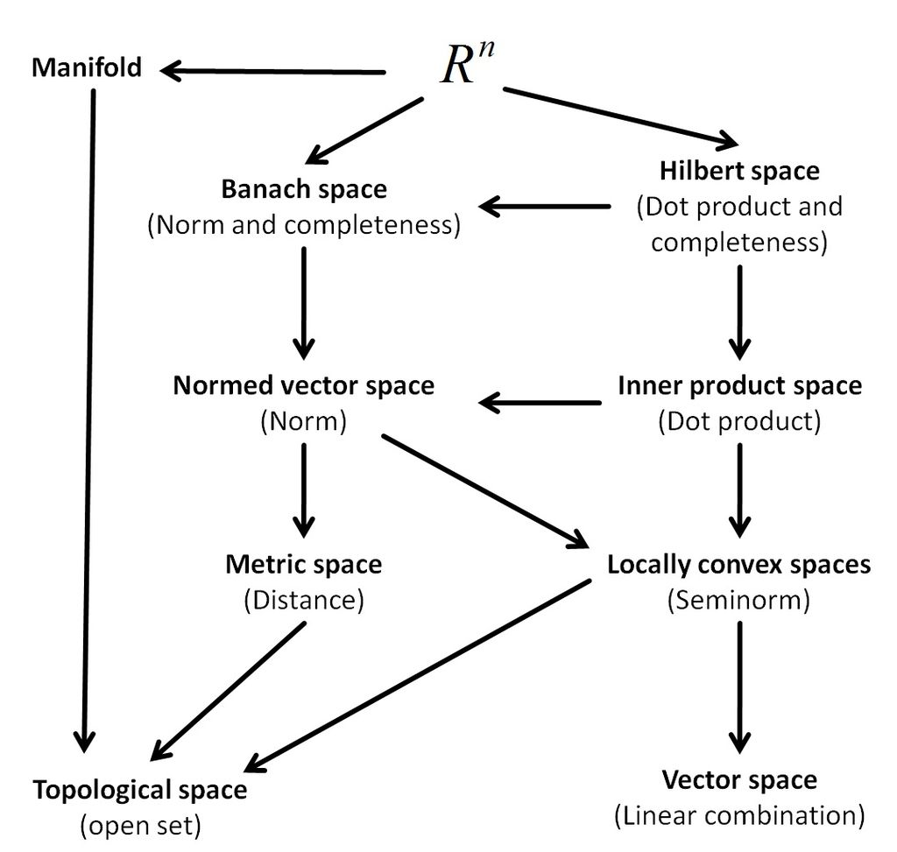

Bundle Adjustment 
2020/05/29 
--- 
# Bundle Adjustment 

## [3D projections](https://en.wikipedia.org/wiki/3D_projection#Perspective_projection)

## [Pinhole camera model](https://en.wikipedia.org/wiki/Pinhole_camera_model#The_geometry_and_mathematics_of_the_pinhole_camera)

## [Space](https://en.wikipedia.org/wiki/Space_(mathematics))

## [Topology](https://en.wikipedia.org/wiki/Topology)

### [Topological space](https://en.wikipedia.org/wiki/Topological_space)
[聊聊拓扑 I](https://zhuanlan.zhihu.com/p/19940774)
[聊聊拓扑 II](https://zhuanlan.zhihu.com/p/20090763)
[聊聊拓扑 III](https://zhuanlan.zhihu.com/p/20090843)

#### [Open set](https://en.wikipedia.org/wiki/Open_set)

#### [Homeomorphism](https://en.wikipedia.org/wiki/Homeomorphism)
Not support squishing.

#### [Homotopy](https://en.wikipedia.org/wiki/Homotopy)
Support squishing.

### [Manifold](https://en.wikipedia.org/wiki/Manifold)

关于流形(manifold)名字的含义: 黎曼开始了关于延展性，维数，以及将 延展性数量化的讨论。他给了这些多度延展的量（几何对象）一个名称，德文写作 mannigfaltigkeit, 英文翻译为 manifold，英文字面意思可以理解为 “多层”，中国第一个拓扑学家江泽涵（北大老教授）把这个词翻译为 “流形”，取自文天祥《正气歌》，“天地有正气，杂然赋流形”，而其原始出处为《易经》，“大哉乾元，万物资始，乃统天。云行雨施，品物流形。” 这个翻 译比英文翻译更加符合黎曼的原意，即多样化的形体.

### [Metric space](https://en.wikipedia.org/wiki/Metric_space)

## Transformations 

### [Projective transformation, aka homography](https://en.wikipedia.org/wiki/Homography)
// TODO 

### [Affine transformation](https://en.wikipedia.org/wiki/Affine_transformation)

# Other notes 
## Regression analysis 
在统计学中，回归分析(regression analysis)指的是确定两种或两种以上变量间相互依赖的定量关系的一种统计分析方法。回归分析按照涉及的变量的多少，分为一元回归和多元回归分析；按照因变量的多少，可分为简单回归分析和多重回归分析；按照自变量和因变量之间的关系类型，可分为线性回归分析和非线性回归分析。

## [Functional form](ba/functional_form.pdf)

## [Cartesian product](https://en.wikipedia.org/wiki/Cartesian_product)

## [Isomorphism](https://en.wikipedia.org/wiki/Isomorphism)

## [Klein bottle](https://en.wikipedia.org/wiki/Klein_bottle)

## [Möbius strip](https://en.wikipedia.org/wiki/M%C3%B6bius_strip)

## [manifold in optimization, and "moving through the manifold"](https://www.quora.com/What-is-a-manifold-in-optimization-and-what-is-the-meaning-of-moving-through-the-manifold)

## [Unbiased estimator](https://www.zhihu.com/question/22983179)

## [Linear and non-linear least sqaures](https://math.stackexchange.com/questions/1593676/linear-vs-non-linear-least-squares)

## tangent space and saddle point
[A comprehensive about the extremum and the saddle point]

### [tangent space](https://math.stackexchange.com/a/834405/681195)
For any differentiable manifold 𝑀, the tangent space 𝑇𝑝𝑀 is defined at **every** point 𝑝.

### [saddle point](https://en.wikipedia.org/wiki/Saddle_point)
In the most general terms, a saddle point for a smooth function (whose graph is a curve, surface or hypersurface) is a stationary point such that the curve/surface/etc. in the neighborhood of that point is **not entirely on any side of the tangent space at that point**.
