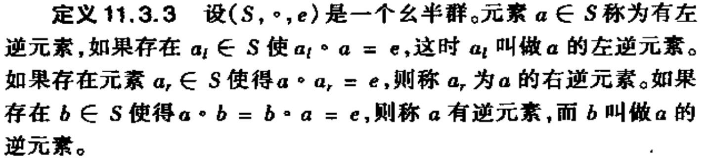
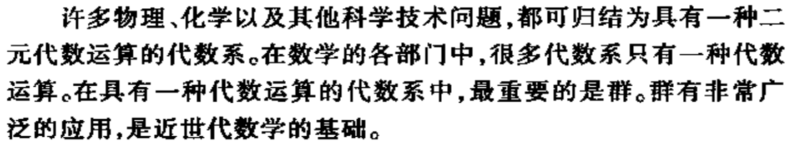
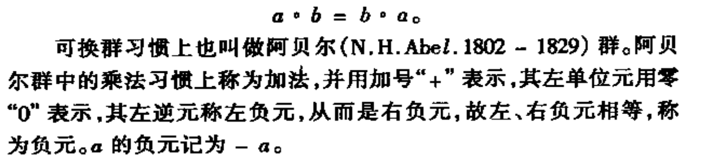

Multiple View Geometry 
2020/05/30 
--- 
- [The course](#the-course)
- [Chapter 1](#chapter-1)
  - [What does orthogonal matrices mean in real world](#what-does-orthogonal-matrices-mean-in-real-world)
  - [Positive definite matrices and minima](#positive-definite-matrices-and-minima)
- [Chapter 2](#chapter-2)
  - [Rodrigues' (rotation) formula](#rodrigues-rotation-formula)
- [Miscellaneous notes](#miscellaneous-notes)
  - [凸函数(convex function)](#凸函数convex-function)
    - [凸集(convex set)](#凸集convex-set)
  - [近世代数(抽象代数)](#近世代数抽象代数)
    - [若干基本概念](#若干基本概念)
    - [若干代数结构](#若干代数结构)
      - [群(group))](#群group)
        - [正规的定义](#正规的定义)
        - [一种条件较弱，但使用更加方便的等价的群定义](#一种条件较弱但使用更加方便的等价的群定义)
      - [环(ring)) 和 [域(field)](https://en.wikipedia.org/wiki/Field_(mathematics))](#环ring-和-域field)
  - [Lie group](#lie-group)
  - [bilinear form](#bilinear-form)
    - [bilinear map](#bilinear-map)
  - [mapping](#mapping)
    - [mapping definition](#mapping-definition)
    - [mapping taxonomy](#mapping-taxonomy)
      - [单射(injective)](#单射injective)
      - [满射(surjective)](#满射surjective)
      - [双射(bijective)](#双射bijective)
    - [同构(isomorphism) 和 同态(homomorphism)](#同构isomorphism-和-同态homomorphism)
  - [Condition and Stability](#condition-and-stability)
  - [domain, codomain, and range](#domain-codomain-and-range)
  - [well-posed vs. ill-posed problem](#well-posed-vs-ill-posed-problem)
  - [bound vector and free vector](#bound-vector-and-free-vector)
  - [Cross product - Math is fun](#cross-product---math-is-fun)
  - [Two forms of Taylor expansion](#two-forms-of-taylor-expansion)
  - [A brief illustration about manifold](#a-brief-illustration-about-manifold)
  - [Matrix exponential](#matrix-exponential)

# The course 
The lecture introduces the basic concepts of image formation - perspective projection and camera motion. The goal is to reconstruct the three-dimensional world and the camera motion from multiple images. To this end, one determines correspondences between points in various images and respective constraints that allow to compute motion and 3D structure. A particular emphasis of the lecture is on mathematical descriptions of rigid body motion and of perspective projection. For estimating camera motion and 3D geometry we will make use of both spectral methods and methods of nonlinear optimization.

# Chapter 1 
## What does orthogonal matrices mean in real world
[Rotation](https://en.wikipedia.org/wiki/Orthogonal_transformation)

[Reflection(mirroring)](https://en.wikipedia.org/wiki/Reflection_(mathematics))

## [Positive definite matrices and minima](mvg/positive_definite_matrices_and_minina.pdf)
[Supplementary material](https://www.khanacademy.org/math/multivariable-calculus/applications-of-multivariable-derivatives/optimizing-multivariable-functions/a/second-partial-derivative-test)

# Chapter 2 
## [Rodrigues' (rotation) formula](https://en.wikipedia.org/wiki/Rodrigues%27_rotation_formula)

# Miscellaneous notes 
## [凸函数(convex function)](https://en.wikipedia.org/wiki/Convex_function)
[为什么数学概念中，将凸起的函数称为凹函数？](为什么数学概念中，将凸起的函数称为凹函数？)

### [凸集(convex set)](https://en.wikipedia.org/wiki/Convex_set)

## 近世代数(抽象代数)

### 若干基本概念

### 若干代数结构
#### [群(group)](https://en.wikipedia.org/wiki/Group_(mathematics))
##### 正规的定义

##### 一种条件较弱，但使用更加方便的等价的群定义

#### [环(ring)](https://en.wikipedia.org/wiki/Ring_(mathematics)) 和 [域(field)](https://en.wikipedia.org/wiki/Field_(mathematics))

## [Lie group](https://en.wikipedia.org/wiki/Lie_group)

## [bilinear form](https://en.wikipedia.org/wiki/Bilinear_form)

### [bilinear map](https://en.wikipedia.org/wiki/Bilinear_map)

## mapping 

### mapping definition 

### mapping taxonomy

#### 单射(injective)
每个抽屉只能被唯一的一个人用。

#### 满射(surjective)
每个抽屉都被人用了。

#### 双射(bijective)
每个抽屉都被唯一的一个人用了。

### 同构(isomorphism) 和 同态(homomorphism)
[直观地理解同构和同态](mvg/isomorphism_homomorphism.pdf)

## [Condition and Stability](mvg/condition_and_stability.pdf)

## [domain, codomain, and range](mvg/domain_codomain_range.png)

## [well-posed vs. ill-posed problem](https://en.wikipedia.org/wiki/Well-posed_problem)

## bound vector and free vector
Being an arrow, a Euclidean vector possesses a definite initial point and terminal point. A vector with fixed initial and terminal point is called a bound vector.[9] When only the magnitude and direction of the vector matter, then the particular initial point is of no importance, and the vector is called a free vector. Thus two arrows ${\displaystyle {\overrightarrow {AB}}}$ and ${\displaystyle {\overrightarrow {A'B'}}}$ in space represent the same free vector if they have the same magnitude and direction

## [Cross product - Math is fun](https://www.mathsisfun.com/algebra/vectors-cross-product.html)

## [Two forms of Taylor expansion](https://math.stackexchange.com/a/3577758/681195)

## [A brief illustration about manifold](https://mathworld.wolfram.com/Manifold.html)

## [Matrix exponential](https://en.wikipedia.org/wiki/Matrix_exponential)