Image Formation
2020/06/14
--- 
# [Derivation of the thin lens equation](http://www.siegelsoft.com/hoeling/RefractionLenses_4/RefractionLenses_410.html)

# 

# Miscellaneous notes 
## [optics](https://en.wikipedia.org/wiki/Optics)
## How digital cameras work?
main cf. [How does a camera work?](https://expertphotography.com/how-does-a-camera-work/)

Bonus: [Photography for Beginners: A Complete Guide](https://expertphotography.com/a-beginners-guide-to-photography/)

### A great book to introduce the techniques of digital photography
Digital Photography by scott kelby
TODO 

### pinhole camera model
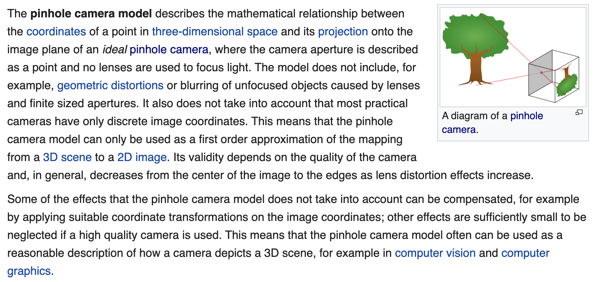

#### pinhole camera 
A pinhole camera is a simple camera without a lens but with a tiny aperture (the so-called pinhole) – effectively a light-proof box with a small hole in one side. Light from a scene passes through the aperture and projects an inverted image on the opposite side of the box.

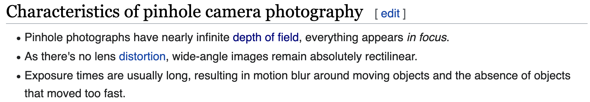

[A short introduction to the parameters of the pinhole camera](https://photo.stackexchange.com/a/22053)
- diaphram
- aperture 
- focal length 
- shutter speed 
- film speed (ISO)
- etc.

[A awesome website to simulate the effect of changing the params of the pinhole camera](https://camerasim.com/camerasim-free-web-app/)

##### diaphram
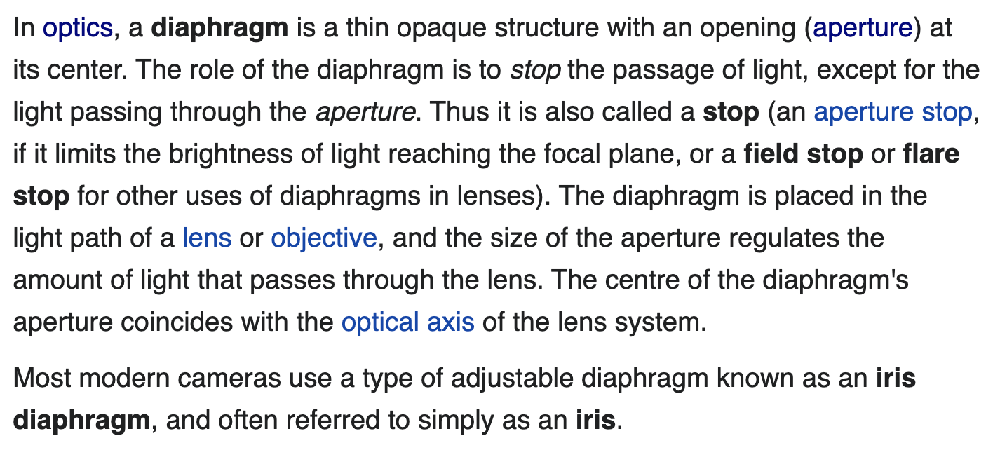
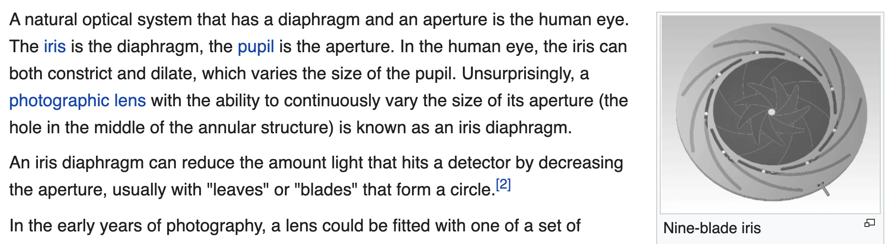

##### [aperture](https://en.wikipedia.org/wiki/Aperture)
##### Field of view
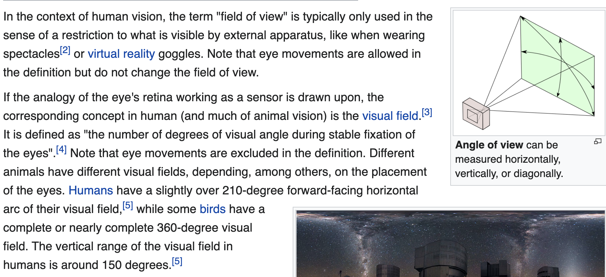

##### [Depth of field](https://en.wikipedia.org/wiki/Depth_of_field)
###### f-number 
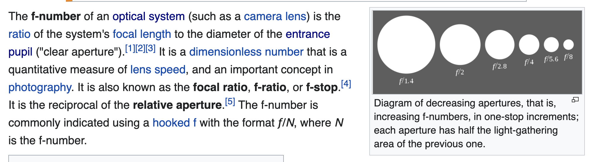
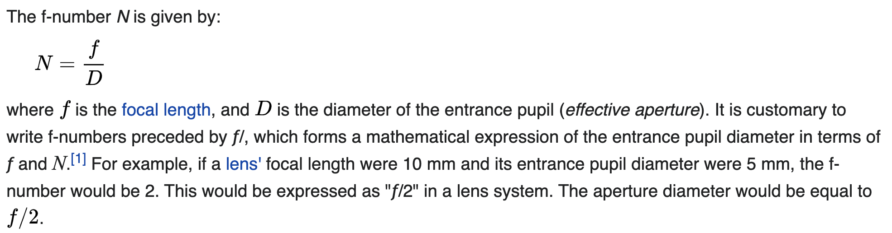

##### shutter 
[simple leaf shutter](https://en.wikipedia.org/wiki/Shutter_(photography)#Simple_leaf_shutter)

[focal-plane shutter](https://en.wikipedia.org/wiki/Focal-plane_shutter)

[A short video introducing how shutter works](https://www.youtube.com/watch?v=fyqbIuTzRVI)

##### film speed
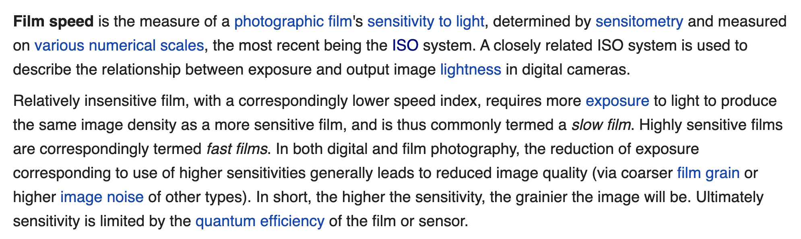
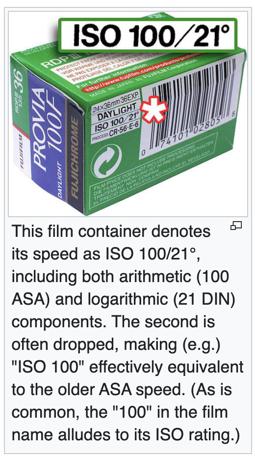

##### [The relationship between the focal length and the distance from the image plane to the optical center](https://www.researchgate.net/post/What_is_the_relationship_between_focal_length_and_distance_to_the_image_plane_from_camera_coordinate_origin)

##### [The relationship between aperture and focal length](https://www.quora.com/What-is-mathematical-relation-between-aperture-and-focal-length-of-objective-lens)

### [ray](https://en.wikipedia.org/wiki/Ray_(optics))
taxonomy of rays

### Stability in photography 
Cameras use gyroscope to meter and counteract motion blur to approach stability.

## [analog and digital signals](https://learn.sparkfun.com/tutorials/analog-vs-digital/all)
[A short intuitive video illustrating the difference between analog and digital signals](https://learn.sparkfun.com/tutorials/analog-vs-digital/all)

[ADC converter in cameras](https://www.lifewire.com/the-adc-of-a-digital-camera-493714)

## Lambertian reflectance

## [radiance, irradiance, and radiant flux](https://www.energetiq.com/technote-understanding-radiance-brightness-irradiance-radiant-flux)

## [The usual way to write translation using matrix representation](https://math.stackexchange.com/q/1128777/681195)

## [skewness and kurtosis in digital image processing](https://dsp.stackexchange.com/a/30439)
### skewness
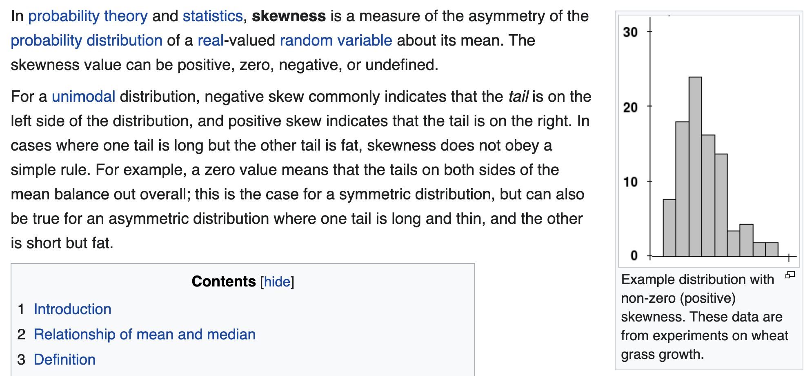

## optic abberrations 
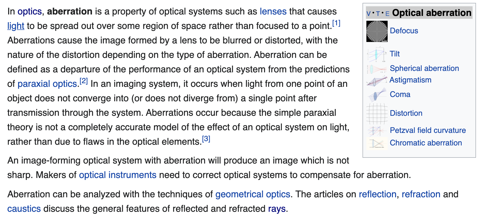

## linear span
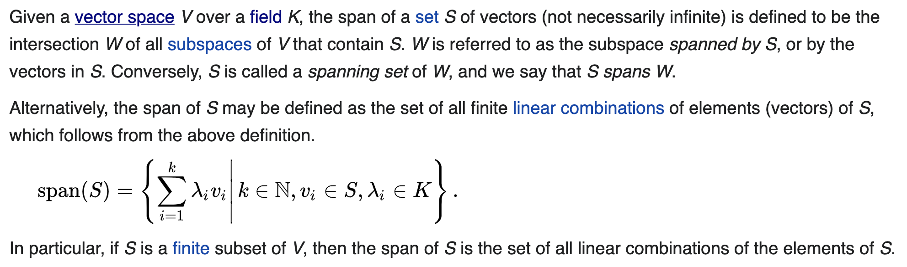

## orthogonal complement 
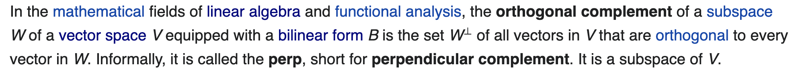
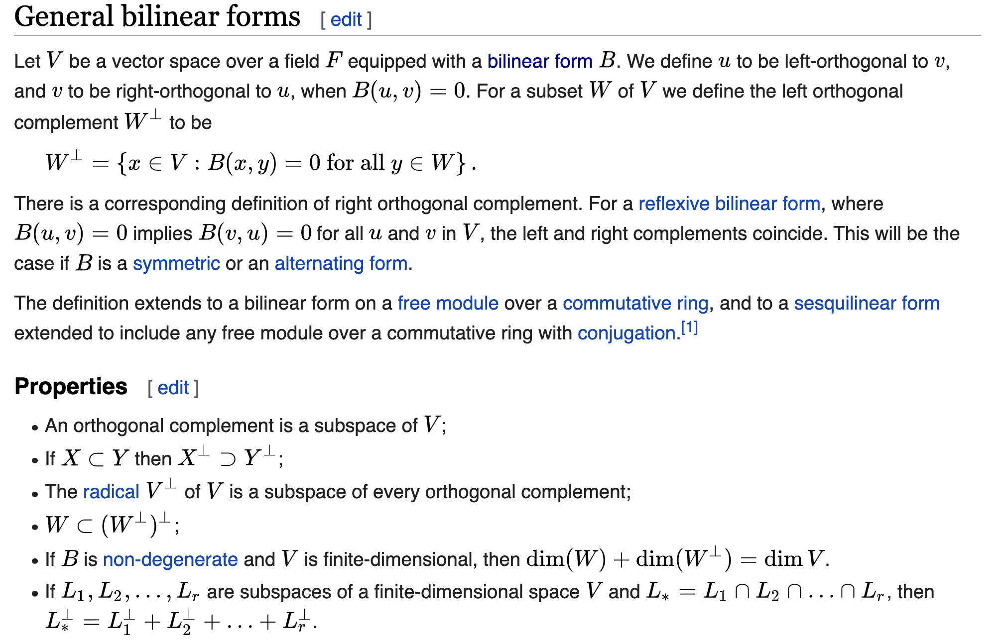

## antipodal points (aka antipodes, 对趾点)
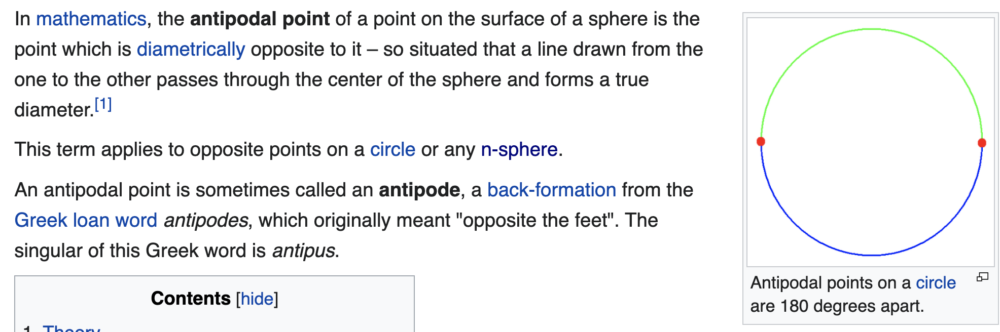

## [Why the image plane is at Z = f in pinhole camera model](https://photo.stackexchange.com/a/117498/92598)

## [How to do the normalization when the focal length is known](https://math.stackexchange.com/a/3721668/681195)

## 

