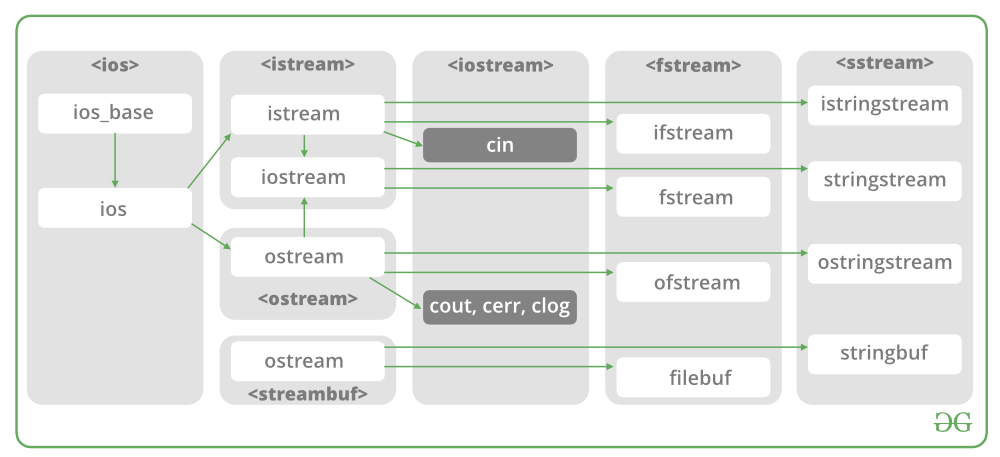
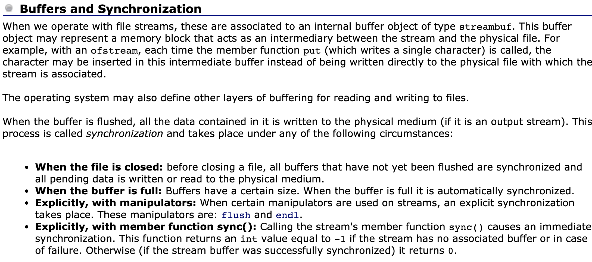

Code Notes 
2020/06/16 
--- 

# C++: the define macro
[Use or not use define? And when?](https://stackoverflow.com/a/10261933/11240780)

[object-like and function-like defines](https://zh.cppreference.com/w/cpp/preprocessor/replace)

# C++: file handling
[A introductory level of file handling in C++](http://www.cplusplus.com/doc/tutorial/files/)
- ofstream 
- ifstream 
- fstream 

Bonus: [C-style file handling](http://www.cplusplus.com/reference/cstdio/)

## <cstdio> or <iostream>?
[A brief discussion](https://qr.ae/pNKYne)

[Another discussion](https://qr.ae/pNKYvR)

## [C++: getline function](http://www.cplusplus.com/reference/string/string/getline/)

### [getline in if / while conditions](https://stackoverflow.com/a/8204171/11240780)

## [Tips and tricks for using C++ I/O (input/output)](http://augustcouncil.com/~tgibson/tutorial/iotips.html)
Not very useful.

## C++: Buffers and Synchronization

# C++: size / length of a string
## [C++: the null terminator in chars](https://stackoverflow.com/a/43424642/11240780)
[C function: strlen()](http://www.cplusplus.com/reference/cstring/strlen/)

## [C++: Find the length / size of a string](https://www.geeksforgeeks.org/5-different-methods-find-length-string-c/)

## [C++: sizeof operator](https://en.cppreference.com/w/cpp/language/sizeof)
[Factors impact the result of the sizeof() operator](https://www.cprogramming.com/tutorial/size_of_class_object.html)

## [C++: size_t type](https://en.cppreference.com/w/cpp/types/size_t)

## [C++: close the opened file as soon as possible](https://stackoverflow.com/a/20556047/11240780)
With the help of stringstream.

## [typeid](https://zh.cppreference.com/w/cpp/language/typeid)

## [Three return paradigms](https://www.learncpp.com/cpp-tutorial/74a-returning-values-by-value-reference-and-address/)
- return by value 
- return by address (pointer) 
- return by reference

## [cout true and false rather than 1 and 0](https://stackoverflow.com/a/15960062/11240780)

## [std::count and std::count_if](https://zh.cppreference.com/w/cpp/algorithm/count)

## [count #lines in a file](https://stackoverflow.com/a/3072840/11240780)

## ['\n' or "\n" or std::endl](https://stackoverflow.com/a/8311177/11240780)
### [Four ways to flush the std::cout buffer](https://support.microsoft.com/en-us/help/94227/how-to-flush-the-cout-buffer-in-visual-c)

## [cin as a condition](https://stackoverflow.com/a/6791545/11240780)

## [Why if / while (!stream.eof()) considered wrong?](https://stackoverflow.com/a/5605159/11240780)

## The >> operator can be a indicator for reading formatted input
- Indicate the reading state 
- Check if the number of "objects" in one line is valid

The reason why we can do this: The >> operator is overridden for std::string and **uses whitespace** as a separator

## [Use std::cout or std::cerr and when?](https://stackoverflow.com/a/16773043/11240780)

## [Use googletest to do unit testing in C++](https://github.com/google/googletest/blob/master/googletest/docs/primer.md)

## (binary) blob / BLOB
A Binary Large OBject (BLOB) is a collection of binary data stored as a single entity in a database management system. Blobs are typically images, audio or other multimedia objects, though sometimes binary executable code is stored as a blob.

## [Macros cannot be placed within any namespaces](https://stackoverflow.com/a/11791202/11240780)

## [std::initializer_list, declared in <initializer_list> header](https://www.learncpp.com/cpp-tutorial/10-7-stdinitializer_list/)

## [lvalue and rvalue](https://www.internalpointers.com/post/understanding-meaning-lvalues-and-rvalues-c)

## [reinterpret_cast](https://zhuanlan.zhihu.com/p/33040213)

## [enum object as function parameter](https://stackoverflow.com/a/5357141/11240780)

## [Why a semicolon is needed after class declaration braces](https://stackoverflow.com/a/785695/11240780)

## [callback function(回调函数)](https://www.zhihu.com/question/19801131/answer/27459821)

## [problems with NULL and prefer nullptr](https://www.geeksforgeeks.org/understanding-nullptr-c/)

## [C++: stack and heap memory](https://stackoverflow.com/a/80113/11240780)

## [constexpr and std::string](https://stackoverflow.com/questions/27123306/is-it-possible-to-use-stdstring-in-a-constexpr)

## [A short intro to C++11 features](https://herbsutter.com/elements-of-modern-c-style/)

## [auto at compile time or runtime](https://stackoverflow.com/a/19623104/11240780)

## [understanding when to/can use constexpr](https://www.geeksforgeeks.org/understanding-constexper-specifier-in-c/)
### [constants in C++](https://www.learncpp.com/cpp-tutorial/const-constexpr-and-symbolic-constants/)
A great material for best practicing constexpr and const!

## [The order of the specifier doesn't matter, but the conventional order is prefered](https://stackoverflow.com/a/10709973/11240780)
### [specifier(说明符)](https://en.cppreference.com/w/cpp/language/declarations#Specifiers)
### [qualifier(限定词)](https://www.quora.com/What-is-the-difference-between-qualifier-and-specifier-in-programming)
Qualifiers modify the specifiers.
There are 4 qualifiers in C++.
### [identifier(标识符)](https://en.cppreference.com/w/cpp/language/identifiers)

## [A website for C++ optimization](https://www.tantalon.com/pete/cppopt/main.htm)

## Tricks about bit-wise operators
[bit operation hacks](http://graphics.stanford.edu/~seander/bithacks.html)
### [bit-wise NOT](https://stackoverflow.com/a/7207403/11240780)
### [Neatest way to filp a boolean value](https://stackoverflow.com/a/611476/11240780)
### [bit-wise operation implementing min and max](https://stackoverflow.com/a/2868506/11240780)

## [DBL_EPSILON, FLT_EPSILON, defined in <cfloat>](http://www.cplusplus.com/reference/cfloat/)
用来描述差值的精度误差。
In C++ it's **std::numeric_limits<double>::epsilon()**, defined in <limits> header.

## [#ifndef and #if !define()](https://blog.csdn.net/TMD_MCU/article/details/78140229)

## [Kahan summatrion algorithm](https://en.wikipedia.org/wiki/Kahan_summation_algorithm) 
[implementation](https://ideone.com/iuPPP)

## floating point in programming
[Best practice for using double or float type in C++](https://stackoverflow.com/a/1074537/11240780)
Basically, prefer **double**. The "right" choice is: use as much precision as you need but not more and choose the right algorithm. 

[Floating point numbers](https://www.doc.ic.ac.uk/~eedwards/compsys/float/)

Advanced: [What Every Computer Scientist Should Know About Floating-Point Arithmetic](https://docs.oracle.com/cd/E19422-01/819-3693/ncg_goldberg.html)

## non-member std::begin() vd member begin() 
To achieve more generic programming, prefer std::begin() 

However, in C++11, there're not std::cbegin() and std::cend() and other constant version non-members. You can implement it yourself with ease.

## [Does header files compiled?](https://stackoverflow.com/a/40775213/11240780)
[C++: Header-only libraries](https://en.wikipedia.org/wiki/Header-only)

## [#pragma once or #ifndef guards?](https://stackoverflow.com/a/787539/11240780)
Prefer #ifndef guards.

## [yaml vs json](http://sangsoonam.github.io/2017/03/13/yaml-vs-json.html)
Prefer yaml, at least in OpenCV.

## [std::copy, defined in <algorithm> header](http://www.cplusplus.com/reference/algorithm/copy/)

## [std::vector::resize](http://www.cplusplus.com/reference/vector/vector/resize/)

## stream iterators
[std::istream_iterators](http://www.cplusplus.com/reference/iterator/istream_iterator/)

[std::ostream_iterators](http://www.cplusplus.com/reference/iterator/ostream_iterator/?kw=ostream_iterator)

## [trait](https://accu.org/index.php/journals/442)
> Think of a trait as a small object whose main purpose is to carry information used by another object or algorithm to determine "policy" or "implementation details". - Bjarne Stroustrup

## 在函数外面再套一个函数，可以使原始函数的调用更加灵活 
e.g. [OpenCV cv::putText](https://stackoverflow.com/a/54616857/11240780)

## std::initializer_list
Notice though that this template class is not implicitly defined and the header <initializer_list> **shall be included** to access it, even if the type is used implicitly.

## [Ways to construct vector of vectors in C++](https://www.techiedelight.com/vector-of-vector-cpp/)

## [assert in C++](https://www.softwaretestinghelp.com/assert-in-cpp/)
1. runtime assertion: assert macro, defined in <cassert> header. 
2. compile time assertion, static_assert keyword (function)

## [tracking reference % and stringify # in C++](https://stackoverflow.com/a/25358316/11240780)

## [conditional operator ?: and its complex rules](https://docs.microsoft.com/en-us/cpp/cpp/conditional-operator-q?view=vs-2019)
The type of the second and the third operand muse be in the rule list, otherwise it's illegal.

> In particular, note that the ternary operator allows any arbitrary expression as its middle operand, despite being listed as having higher precedence than the assignment and comma operators. 

Therefore, beware adding parentheses.

## unsigned char and char 
char与unsigned char都占用一个字节（8bit）的内存

[Why use unsigned char in OpenCV](https://stackoverflow.com/a/16944966/11240780)

[char and int type in C/C++](https://stackoverflow.com/a/4337252/11240780)

## [Must I appending an "f" at the end of a number in C++?](https://stackoverflow.com/a/16722287/11240780)
Without f: 
   1. might be additional codes genenrated, compiler specific. 
   2. some arithmetic expression might be surprising, e.g. float a = 1 / 2 -> a = 0;

## [No suffix types for unsigned char types, only for integral and floating type suffixes](https://stackoverflow.com/a/2304756/11240780)

## [pre/pose-fix increment operators in C++](https://stackoverflow.com/a/5209616/11240780)

## [EXIT_SUCCESS, EXIT_FAILURE macros, defined in <cstdlib>](https://stackoverflow.com/questions/8867871/should-i-return-exit-success-or-0-from-main)
Prefer return 0 instead.
### [std::exit(), defined in <cstdlib>](https://en.cppreference.com/w/cpp/utility/program/exit)

## [When to use enum class?](https://stackoverflow.com/a/8357366/11240780)

## 
