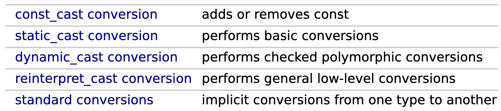
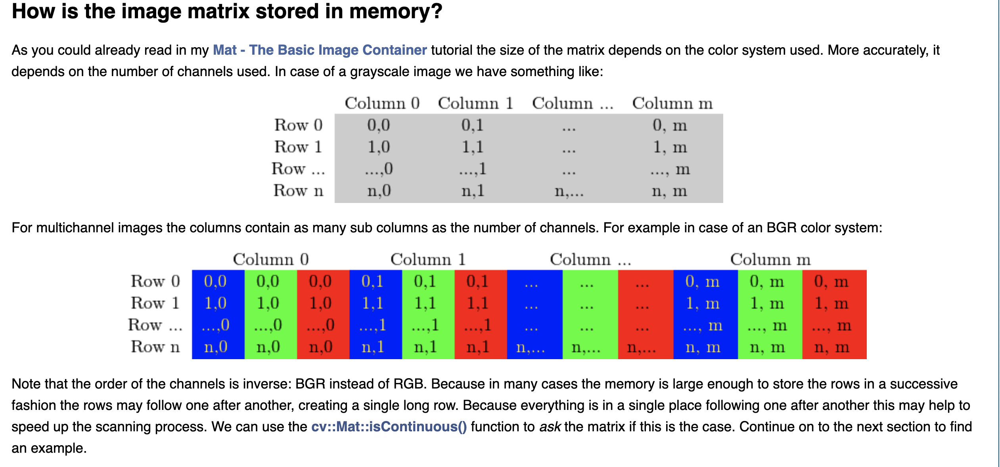

OpenCV Notes 
2020/06/18 
--- 

# Basics 
## [norm](https://docs.opencv.org/2.4/modules/core/doc/operations_on_arrays.html#norm)

## [reshape function](https://www.cnblogs.com/denny402/p/5035535.html)

## [Basic Mat types](https://docs.opencv.org/4.3.0/d6/d6d/tutorial_mat_the_basic_image_container.html)
1. [Mat](https://docs.opencv.org/3.4/d3/d63/classcv_1_1Mat.html#details)
2. [Mat_](https://docs.opencv.org/3.4/df/dfc/classcv_1_1Mat__.html#details)
3. [Matx](https://docs.opencv.org/3.4/de/de1/classcv_1_1Matx.html#details)
### [cv::Mat::create](https://docs.opencv.org/4.3.0/d3/d63/classcv_1_1Mat.html#a55ced2c8d844d683ea9a725c60037ad0)

## [cv::waitKey()](https://docs.opencv.org/3.4/d7/dfc/group__highgui.html#ga5628525ad33f52eab17feebcfba38bd7)
unit millisecond, aka ms = 1 / 1000 * second;

## [difference between Vec and Point](https://answers.opencv.org/question/129648/cvvec3f-vs-cvpoint3f/)

## [4 ways to copy image and their performance](https://blog.csdn.net/chaipp0607/article/details/58603167)
### [copyTo and clone](https://blog.csdn.net/liyi1149549057/article/details/89404458?utm_medium=distribute.pc_relevant.none-task-blog-BlogCommendFromMachineLearnPai2-1.nonecase&depth_1-utm_source=distribute.pc_relevant.none-task-blog-BlogCommendFromMachineLearnPai2-1.nonecase)
> "The major difference is that when the destination matrix and the source matrix have the same type and size, copyTo will not change the address of the destination matrix, while clone will always allocate a new address for the destination matrix."

## [cv::Scalar](https://docs.opencv.org/2.4.2/modules/core/doc/basic_structures.html#Scalar_)

## cv::String in place of std::string when coding opencv apps
Be casual!

## [The ideas behind undirstortion in OpenCV](https://stackoverflow.com/a/21960181/11240780)

## The line of work to study camera calibration 
1. [Matlab tutorial](https://www.mathworks.com/help/vision/ug/camera-calibration.html)
  - [Distortion](https://en.wikipedia.org/wiki/Distortion_(optics)#Software_correction)
2. [Camera calibration with OpenCV](https://docs.opencv.org/master/d4/d94/tutorial_camera_calibration.html)
3. Advanced [Camera Calibration Toolbox with examples](http://www.vision.caltech.edu/bouguetj/calib_doc/index.html#examples)
4. [OpenCV cv::initUndistortRectifyMap function and the method it uses (**inverse mapping algorithm**)](https://docs.opencv.org/3.1.0/da/d54/group__imgproc__transform.html#ga7dfb72c9cf9780a347fbe3d1c47e5d5a)

main cf. paper: *Zhang, Z. “A Flexible New Technique for Camera Calibration.” IEEE Transactions on Pattern Analysis and Machine Intelligence. Vol. 22, No. 11, 2000, pp. 1330–1334.*
### [Undistorted result](https://www.cnblogs.com/riddick/p/6711263.html)
总像素减少，十字边缘区域变模糊。

## cv::Mat::eye, cv::Mat::ones, cv::Mat::zeros, cv::Mat::diag are functions, not types
e.g. cv::Mat::eye R(3, 3, CV_8UC1) is forbidden.

## [Flexible extension of cv::findChessboardCorners()](https://stackoverflow.com/questions/37541683/finding-checkerboard-points-in-opencv-for-any-random-chessboard-pattern-size-no/37577579)

## Explicit cast: [C++ style casting](https://en.cppreference.com/w/cpp/language/explicit_cast) and C style casting
[Which is better?](https://stackoverflow.com/a/18414126/11240780)

When the C-style cast expression is encountered, the compiler attempts to interpret it as the following cast expressions, [in this order](https://en.cppreference.com/w/cpp/language/explicit_cast):
 - const_cast 
 - static_cast 
 - reinterpret_cast

[A short intro](https://www.jianshu.com/p/5163a2678171)

[GeeksforGeeks series](https://www.geeksforgeeks.org/static_cast-in-c-type-casting-operators/?ref=rp)

## [static keyword](https://www.geeksforgeeks.org/static-keyword-cpp/)
[An comprehensive elaboration for static keyword, with mistakes!](https://www.cnblogs.com/33debug/p/7223869.html)

[When should the static keyword come into use?](https://stackoverflow.com/a/15235626/11240780), also see [this](https://softwareengineering.stackexchange.com/a/113034), very helpful!

## [cv::imread(), the loaded data type](https://stackoverflow.com/a/13578018/11240780)

## [alpha channel and 32 bits image](https://www.webopedia.com/TERM/A/alpha_channel.html)

## [element access methods remark](https://opencv.programmingpedia.net/en/tutorial/1957/pixel-access)
Good material!

## OpenCV basic data structures
### cv::Mat 
### [cv::Vec](https://docs.opencv.org/4.3.0/d6/dcf/classcv_1_1Vec.html)
### cv::Scalar 
### cv::Point 

## [OpenCV data type](https://docs.opencv.org/3.4/d0/d3a/classcv_1_1DataType.html)
CV_<bit-depth>{U|S|F}C(<number_of_channels>)
- U, unsigned char (uchar), 8 bits
- S, short, 16 bits
- F, float, 32 bits

The types are **traits**.

## [Raster/vector graphics/images](https://www.printcnx.com/resources-and-support/addiational-resources/raster-images-vs-vector-graphics/)

## [Image file formats](https://en.wikipedia.org/wiki/Image_file_formats)
- jpeg
  - 8 bits grayscale or 24 bits color (RGB)
- png
  - 24 bits or 48 bits (w/o alpha)

## [Image reading and writing](https://docs.opencv.org/master/d4/da8/group__imgcodecs.html)
The imgcodecs module of OpenCV 
  - Image decoding
  - Image compression 
  - How to create an image with alpha channel 
  - How to save a png format file 
  - Different data types correpond to different image formats, and the images have to be specified with the correct extension while writing with the cv::imwrite() function.
    - Generally, cv::imwrite() writes 8 bits one-channel (gray) or 32 bits three-channel image (color).
  - In reading, cv::imread() function determines the type of an image by the content, not by the file extension.

### [imread modes, important while reading](https://docs.opencv.org/master/d4/da8/group__imgcodecs.html#ga61d9b0126a3e57d9277ac48327799c80)
By default, the mode of imread() is CV_IMREAD_COLOR which sets the data type as CV_8UC3

[Load images with four channels with the aid of imread modes](https://stackoverflow.com/a/29547458/11240780)

## [Scan image](https://docs.opencv.org/4.3.0/db/da5/tutorial_how_to_scan_images.html)
Good material!

Methods: 
  1. pointer 
  2. iterator 
  3. on-the-fly address calculation 
  4. Look up tables, with the OpenCV built-in core func cv::LUT()

Notes: 
  1. Time measure in OpenCV 
    - cv::getTickCount() and cv::getTickFrequency() 
  2. Pre-calculated lookup table is very helpful. 
  3. The rounding down trick: uchar I = (int / divide_number) * divide_number.
  4. cv::Mat::data returns the pointer pointing to the first row and the first col.
    - This is the simplest way to check whether an image inputing operator success or not
    - Also helpful in scanning throught the whole image.
  5. cv::Mat_ vs cv::Mat::at 
    - > If you need to do multiple lookups using this method for an image it may be troublesome and time consuming to enter the type and the at keyword for each of the accesses. To solve this problem OpenCV has a cv::Mat_ data type. It's the same as Mat with the extra need that at definition you need to specify the data type through what to look at the data matrix, however in return you can use the operator() for fast access of items. To make things even better this is easily convertible from and to the usual cv::Mat data type. A sample usage of this you can see in case of the color images of the function above. Nevertheless, it's important to note that the same operation (with the same runtime speed) could have been done with the cv::Mat::at function. It's just a less to write for the lazy programmer trick.

## When use cv::namedWindow()?
In combination with UI, e.g. cv::creataTrackbar(), to change the properties of the window, e.g. cv::WINDOW_AUTOSIZE, cv::WINDOW_NORMAL, etc.

## imshow will automatically bound the elements' value of the image passed, to the range [0, 255], aka CV_8U*

## [OpenCV: saturate_cast](https://docs.opencv.org/4.3.0/db/de0/group__core__utils.html#gab93126370b85fda2c8bfaf8c811faeaf)
Resembles static_cast, tuned for uchar, ushort, etc.
### [saturate arithmetic](https://en.wikipedia.org/wiki/Saturation_arithmetic)
### [C++17: std::clamp](https://en.cppreference.com/w/cpp/algorithm/clamp)
Use in combination with INT_MAX, INT_MIN, etc.

**Nested conditional operator ?:**
  - return (v < lo) ? lo : (v > hi) ? hi : v;

## [Passing cv::Mat, const cv::Mat, cv::Mat &, const cv::Mat &?](https://stackoverflow.coom/a/23486280/11240780)
Only the header of the Mat is restrained.
### [Passing const cv::Mat &, and cv::Mat::create](https://docs.opencv.org/4.3.0/d3/d63/classcv_1_1Mat.html#a55ced2c8d844d683ea9a725c60037ad0)

## How image stored in OpenCV?
  **Important!**

## [Kernel](https://en.wikipedia.org/wiki/Kernel_(image_processing))
### Image normalization
Normalization is defined as the division of each element in the kernel by the sum of all kernel elements, so that the sum of the elements of a normalized kernel is unity. This will ensure the average pixel in the modified image is as bright as the average pixel in the original image.
#### [Various "normalization"](https://stackoverflow.com/a/33611556/11240780)
### [A collection of kernels](https://lodev.org/cgtutor/filtering.html)

## [Fourier transform in place of spatial filtering]
[Discussion 1](https://stackoverflow.com/questions/26353003/how-to-compute-discrete-fourier-transform/26355569#26355569)

[Discussion 2](https://stackoverflow.com/questions/49062061/optimized-image-convolution-algorithm)

[Implementation procedures](https://stackoverflow.com/a/37781247/11240780)

### [Padding before filtering in frequency domain](https://dsp.stackexchange.com/a/3446)
Because of circular convolution.
### [Convolution theorem](https://en.wikipedia.org/wiki/Convolution_theorem)
#### [Symmetric convolution](https://en.wikipedia.org/wiki/Symmetric_convolution)
TODO 
#### [Circular convolution](https://en.wikipedia.org/wiki/Circular_convolution)

## [continuity of matrix](https://stackoverflow.com/a/26685567/11240780)

## [**A fantanstic websites for image processing learners!**](http://homepages.inf.ed.ac.uk/rbf/HIPR2/index.htm)

## [Query and train set in feature matching](https://stackoverflow.com/a/10768362/11240780)

## [KDT tree to search matched descriptors](https://en.wikipedia.org/wiki/K-d_tree)
TODO

## 

