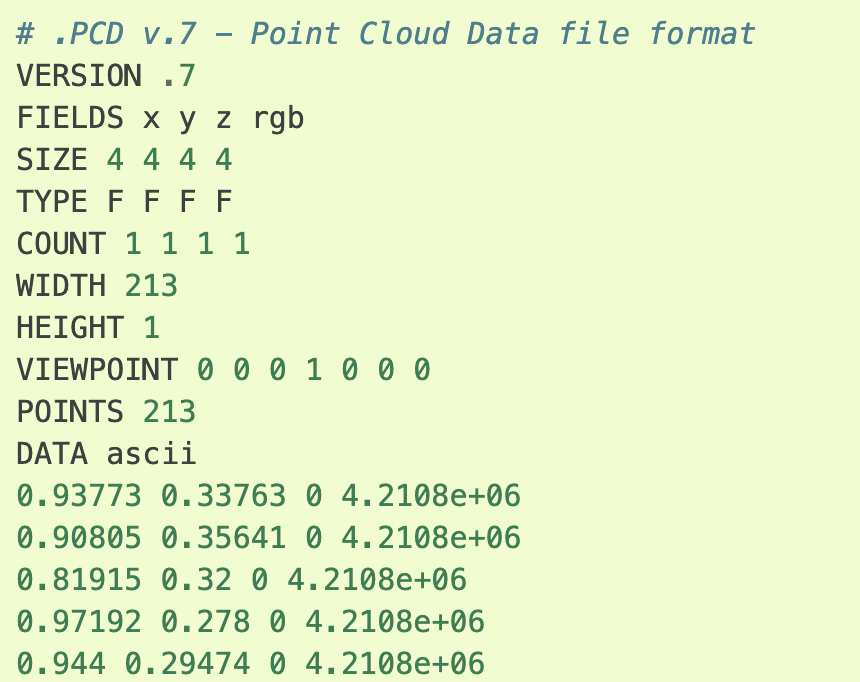

PCL Notes 
2020/06/18 
--- 

# issues
## Why in pcl the rgb color is represented with a single float number?

[A maybe useful material](https://photoshop.fandom.com/wiki/Color_value)

# Miscellaneous notes
## [The pcd file format](https://pcl.readthedocs.io/projects/tutorials/en/latest/pcd_file_format.html#pcd-file-format)

## File I/O 
### [Load pcd file](https://pcl.readthedocs.io/projects/tutorials/en/latest/reading_pcd.html#reading-pcd)
### [Write pcd file](https://pcl.readthedocs.io/projects/tutorials/en/latest/writing_pcd.html#writing-pcd)

## [std::cout alignment](https://stackoverflow.com/questions/2485963/c-alignment-when-printing-cout)
**Prefer printf** over std::cout equipped with iomanip.
### [Use printf to alignment the output](http://www.cplusplus.com/reference/cstdio/printf/)
#### [printf, fprintf, sprintf](https://stackoverflow.com/questions/4627330/difference-between-fprintf-printf-and-sprintf)